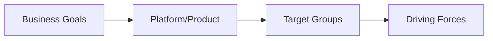
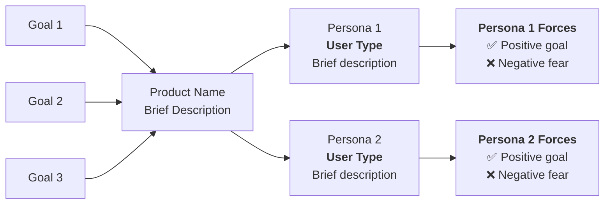

# Mermaid GitHub Compatibility Standards

## Overview

This document provides tested guidelines for creating Mermaid diagrams that render reliably on GitHub, based on extensive real-world experience with trigger map visualizations.

## GitHub Rendering Best Practices

### File Location for Maximum Compatibility
- **README.md files** - Most reliable rendering
- **Regular .md files in repository** - Limited compatibility
- **Issues and Pull Requests** - Full Mermaid support
- **Wiki pages** - Full support

### Color Scheme Guidelines

**Use Light Gray Professional Palette:**
```mermaid
%% Professional Light Gray Palette
classDef businessGoal fill:#f3f4f6,color:#000000,stroke:#d1d5db,stroke-width:3px
classDef platform fill:#e5e7eb,color:#000000,stroke:#d1d5db,stroke-width:4px
classDef targetGroup fill:#f9fafb,color:#000000,stroke:#d1d5db,stroke-width:2px
classDef drivingForces fill:#f3f4f6,color:#000000,stroke:#d1d5db,stroke-width:2px
```

**Avoid:**
- Bright, saturated colors that look unprofessional
- Red/green combinations that may not render consistently
- Complex gradient fills or advanced styling

### Diagram Layout Optimization

**For Trigger Maps - Use Left-to-Right Flow:**


**Benefits of Central Platform Node:**
- Improves visual clarity and conceptual understanding
- Reduces complexity for GitHub rendering engine
- Makes the solution explicit in the business model
- Creates cleaner connection patterns

### Complexity Management

**Recommended Limits:**
- **Maximum 15-20 nodes** per diagram for reliable rendering
- **Maximum 30 connections** between nodes
- **Keep text labels concise** - avoid paragraph-length descriptions
- **Use line breaks sparingly** in node labels

**Content Optimization:**
- Combine related concepts into single nodes when possible
- Use summary descriptions rather than detailed lists
- Consider creating multiple simpler diagrams instead of one complex diagram

## Trigger Map Specific Guidelines

### Standard Trigger Map Structure


### Combining Positive and Negative Driving Forces
**Recommended Pattern:**
- Use ✅ for positive driving forces (what users want)
- Use ❌ for negative driving forces (what users want to avoid)
- Combine both in single node per persona for cleaner layout

## Troubleshooting Common Issues

### Diagram Not Rendering
1. **Check syntax** - Use Mermaid Live Editor to validate
2. **Reduce complexity** - Simplify to test if it's a size issue
3. **Move to README.md** - Better rendering reliability
4. **Remove advanced styling** - Use basic color classes only

### Text Rendering Issues
1. **Escape HTML characters** if using special symbols
2. **Use `<br/>` for line breaks** instead of actual line breaks
3. **Keep labels concise** - long text may not render properly
4. **Use double quotes** around all text labels

### Layout Problems
1. **Use `flowchart LR`** for left-to-right trigger maps
2. **Add central node** to reduce connection complexity
3. **Group related nodes** to improve visual flow
4. **Test on different screen sizes** - GitHub renders differently on mobile

## Testing Workflow

### Before Committing Diagrams
1. **Test in Mermaid Live Editor** (https://mermaid.live/)
2. **Copy exact syntax** to your markdown file
3. **Commit and check GitHub rendering** 
4. **Iterate if needed** - GitHub may render differently than live editor

### Iterative Improvement Process
1. **Start simple** - Basic structure first
2. **Add complexity gradually** - Test each addition
3. **Optimize for clarity** - Professional appearance over complexity
4. **Get stakeholder feedback** - Ensure diagram communicates effectively

## Integration with Whiteport Method

### When to Use Mermaid Diagrams
- **Trigger map visualizations** - Core Whiteport artifact
- **System architecture overviews** - High-level technical diagrams
- **User journey flows** - Process visualization
- **Stakeholder relationship maps** - Business ecosystem views

### Documentation Standards
- **Always include both text and visual** versions of trigger maps
- **Embed diagrams in README** for executive summary impact
- **Provide separate poster files** for detailed visualization
- **Use consistent styling** across all project diagrams

This ensures professional, reliable diagram rendering that enhances rather than detracts from Whiteport method deliverables.
