# 🎯 Whiteport Strategic Content Framework
## Visual Guide to Integrated Models

---

## ✏️ **The Whiteport Sketch-to-Code Method**

The Whiteport method revolutionizes digital product design by placing **hand-drawn sketches at the center of strategic development**. This approach transforms the designer from a pixel-pusher into the **creative linchpin** of the entire project.

```mermaid
graph TD
    A["📋 User Scenarios<br/>Step-by-step user journeys<br/>Connected to business goals"] --> B["🎬 Scenario Steps<br/>Individual interaction moments<br/>Specific user actions & decisions"]
    B --> C["✏️ Hand-Drawn Sketches<br/>Interactive iterative exploration<br/>Designer as creative authority"]
    C --> D["📖 Synopsis Documentation<br/>Detailed sketch descriptions<br/>Development-ready specs"]
    D --> E["🧩 Component Library<br/>Reusable design patterns<br/>Systematic organization"]
    E --> F["👨‍💻 Development Handoff<br/>Clear specifications<br/>Strategic rationale"]
    
    E -.-> B
    
    G["🎯 Strategic Models<br/>Trigger Map + Awareness + Golden Circle<br/>Research-backed decisions"] -.-> A
    G -.-> B
    G -.-> C
    
    style A fill:#e3f2fd
    style B fill:#e1f5fe
    style C fill:#ffebee
    style D fill:#e8f5e8
    style E fill:#fff3e0
    style F fill:#f1f8e9
    style G fill:#fce4ec
```

### **Core Methodology Principles**

**🎨 Designer as Creative Linchpin**  
The designer guides the entire creative process, with AI agents handling documentation and technical implementation while preserving the designer's creative vision.

**✏️ Hand-Drawn Sketch Primacy**  
Conceptual sketches become the central communication tool, making complex ideas immediately understandable to all stakeholders while maintaining focus on core interactions.

**🔄 Interactive Iterative Exploration**  
User scenarios are explored step-by-step through sketching, allowing continuous refinement and discovery of optimal solutions without the overhead of high-fidelity design.

**📋 Scenario-Driven Development**  
Every sketch serves a specific user scenario connected to business goals, ensuring purposeful design that drives measurable outcomes.

**🤖 AI-Assisted Documentation**  
Strategic frameworks guide AI agents in creating systematic documentation, turning creative sketches into development-ready specifications.

---

## 🧭 **Strategic Foundation: Six Strategic Models**

To ensure every sketch serves both user psychology and business objectives, the Whiteport method integrates **six strategic models** when designing digital products:

1. **✏️ Whiteport Sketching Technique** - Hand-drawn exploration as primary design communication
2. **📊 Trigger Map Methodology** - Maps business goals to user driving forces
3. **📈 Customer Awareness Cycle** - Matches content to user knowledge levels  
4. **🎯 Golden Circle Model** - Structures purpose-driven messaging
5. **⭐ 5-Point Strategic Formula** - Integrates all models into systematic approach
6. **🤖 AI-Powered Content Strategy** - Generates research-backed content systematically

```mermaid
graph TD
    A["✏️ Whiteport Sketch-to-Code Method<br/>Hand-drawn sketches + Scenario exploration<br/>Designer as creative linchpin"] 
    A --> B["📊 Trigger Map<br/>Business Goals + Target Users + Driving Forces"]
    A --> C["📈 Customer Awareness Cycle<br/>Unaware → Problem → Solution → Product → Most Aware"]
    A --> D["🎯 Golden Circle<br/>WHY → HOW → WHAT"]
    B --> E["⭐ 5-Point Formula<br/>Business + User + Forces + Level + WHY"]
    C --> E
    D --> E
    E --> F["🎨 Strategic Content<br/>AI Prompts + Purpose-Driven Design"]
    
    style A fill:#ffebee
    style B fill:#fff3e0
    style C fill:#f3e5f5
    style D fill:#e8f5e8
    style E fill:#e3f2fd
    style F fill:#f9fbe7
```

---

## 1️⃣ **Whiteport Sketching Technique**
*Hand-drawn exploration as primary design communication*

**Purpose**: Establishes sketching as the central creative and communication tool, where designers maintain creative authority while enabling systematic AI-assisted development.

*Real example of Whiteport Sketching Technique focusing on page-level design exploration. Shows the complete progression from initial ideation ("Innovation days", "Give and War") through iterative wireframe development to final "Create stream" modal specifications.*

**Key Sketching Principles Demonstrated**:
- **Designer as Creative Linchpin**: Hand-drawn exploration maintains creative authority over design decisions
- **Iterative Page Design**: Multiple variations of the same interface elements showing continuous refinement
- **Component-Level Thinking**: Systematic exploration of individual UI elements (forms, modals, navigation)
- **Scenario-Driven Sketching**: Each sketch serves the specific "Create stream" user journey
- **Progressive Fidelity**: Evolution from rough concepts to development-ready specifications
- **AI-Ready Documentation**: Final sketches contain sufficient detail for systematic AI-assisted development

**Visual Elements Shown**:
- **Exploration Phase** (left): Cloud-style ideation, stream management concepts, component library thinking
- **Refinement Phase** (right): Detailed modal wireframes, form specifications, precise UI elements
- **Complete User Flow**: From main interface through modal interaction to final confirmation
- **Development-Ready Output**: Clear enough specifications for AI tools to generate code

**More Examples**: For additional real-world examples of the Whiteport Sketching Technique in practice, visit [Whiteport.com](https://whiteport.com) to see complete case studies and sketching workflows.

**Academic Foundation**: While sketching in design has ancient roots, the systematic use of sketches in software development draws from established design methodologies and iterative development practices.

---

## 2️⃣ **Trigger Map Methodology**
*Based on Effect Mapping and user research best practices*

**Purpose**: Maps business goals to user driving forces through detailed persona analysis

```mermaid
graph LR
    B1["📈 Revenue Growth<br/>☑️ Increase conversion 25%<br/>☑️ Reduce churn rate<br/>☑️ Improve customer LTV"]
    B2["🤝 User Engagement<br/>☑️ 70% daily active users<br/>☑️ Cross-feature adoption<br/>☑️ Community building"]
    B3["🎯 Market Leadership<br/>☑️ Industry recognition<br/>☑️ Competitive advantage<br/>☑️ Brand differentiation"]
    
    P1["🧑‍💼 Alex Active<br/>Regular User<br/>Content creator<br/>Socially motivated participant"]
    P2["👩‍💼 Morgan Manager<br/>Team Lead<br/>Former consultant<br/>Results-driven, efficiency-focused"]
    P3["👨‍💻 Taylor Tech<br/>Power User<br/>Software engineer<br/>Privacy-conscious, customization-oriented"]
    
    U1["Morgan's Usage Goals<br/>✅ Achieve team success<br/>✅ Deliver efficient solutions<br/>✅ Gain leadership recognition<br/>❌ Avoid team friction<br/>❌ Don't miss deadlines<br/>❌ No complex processes"]
    U2["Alex's Usage Goals<br/>✅ Connect with community<br/>✅ Share creative work<br/>✅ Feel valued and included<br/>❌ Don't feel judged<br/>❌ Avoid technical barriers<br/>❌ No overwhelming features"]
    U3["Taylor's Usage Goals<br/>✅ Optimize workflows<br/>✅ Customize experience<br/>✅ Maintain data control<br/>❌ Avoid feature bloat<br/>❌ Don't compromise security<br/>❌ No forced social features"]
    
    B1 -.-> P1
    B1 -.-> P2
    B1 -.-> P3
    
    B2 -.-> P1
    B2 -.-> P2
    B2 -.-> P3
    
    B3 -.-> P1
    B3 -.-> P2
    B3 -.-> P3
    
    P1 --> U2
    P2 --> U1
    P3 --> U3
    
    style P1 fill:#fff3e0
    style U2 fill:#fff3e0
```

**Key Components**:
- **Business Visions**: Soft goals with hard measurable outcomes
- **Target User Groups**: Prioritized personas with rich context
- **Driving Forces**: Positive goals (wants) and negative goals (avoidance)
- **Strategic Insights**: Business-user goal alignment

**Wikipedia Reference**: [Effect mapping](https://en.wikipedia.org/wiki/Effect_mapping) - Strategic planning technique

---

## 3️⃣ **Customer Awareness Cycle**
*Eugene Schwartz's model from "Breakthrough Advertising" (1966)*

**Purpose**: Match content complexity and messaging to user's knowledge level

```mermaid
graph LR
    A["🤷 Unaware<br/>Don't know problem exists<br/>'Did you know...'<br/>Stories & Secrets"] 
    A --> B["😟 Problem Aware<br/>Know problem, not solutions<br/>'Many struggle with...'<br/>Gain & Pain"]
    B --> C["💡 Solution Aware<br/>Know solutions exist<br/>'We have proven...'<br/>Claims & Proof"]
    C --> D["🎯 Product Aware<br/>Know your product<br/>'Only this month...'<br/>Features & Offers"]
    D --> E["🚀 Most Aware<br/>Ready to buy<br/>'Don't forget to add...'<br/>Bundles & Accessories"]
    
    style A fill:#ffcdd2
    style B fill:#fff3e0
    style C fill:#e3f2fd
    style D fill:#e8f5e8
    style E fill:#f1f8e9
```

**The Five Levels**:
- **Unaware**: Don't know problem exists → Educational content
- **Problem Aware**: Know problem, not solutions → Validation & empathy  
- **Solution Aware**: Know solutions exist → Differentiation & proof
- **Product Aware**: Know your product → Trust building & features
- **Most Aware**: Ready to purchase → Action & urgency

**Reference**: [Eugene M. Schwartz](https://en.wikipedia.org/wiki/Eugene_M._Schwartz) - Master copywriter and advertising strategist

---

## 4️⃣ **Golden Circle Model**
*Simon Sinek's framework from "Start With Why" (2009)*

**Purpose**: Structure content from inspiring purpose to specific actions

```mermaid
graph TD
    subgraph "Golden Circle"
        A["🎯 WHY<br/>Purpose & Belief<br/>'We believe...'<br/>Core Mission"]
        B["⚙️ HOW<br/>Process & Values<br/>'Our unique approach...'<br/>Differentiation"]
        C["📦 WHAT<br/>Products & Services<br/>'We offer...'<br/>Tangible Results"]
    end
    
    A --> B
    B --> C
    
    D["💝 Emotional Connection<br/>Limbic Brain<br/>Trust & Loyalty"] -.-> A
    E["🧠 Rational Justification<br/>Neocortex<br/>Features & Facts"] -.-> C
    
    style A fill:#ffebee
    style B fill:#e8f5e8
    style C fill:#e3f2fd
    style D fill:#fce4ec
    style E fill:#f3e5f5
```

**The Three Levels**:
- **WHY**: Purpose, belief, cause (emotional connection)
- **HOW**: Process, values, differentiators (rational bridge)  
- **WHAT**: Products, services, results (tangible proof)

**Key Insight**: People buy WHY you do it, not WHAT you do

**Wikipedia Reference**: [Simon Sinek](https://en.wikipedia.org/wiki/Simon_Sinek) - Author and inspirational speaker
**Book Reference**: [Start With Why](https://en.wikipedia.org/wiki/Start_With_Why)

---

## 5️⃣ **5-Point Strategic Content Formula**
*Whiteport original integration of all models*

**Purpose**: Systematic checklist ensuring every content decision serves both business and user needs

```mermaid
graph TD
    A["1️⃣ What We Want Them To Do<br/>🎯 Business Goals Drive Everything<br/>Clear, Measurable Objectives"]
    A --> B["2️⃣ Married to What User Wants<br/>💝 Persona Usage Goals Alignment<br/>Mutual Benefit Identification"]
    B --> C["3️⃣ Care for Driving Forces<br/>🧠 Address Fears, Amplify Desires<br/>Emotional Resonance"]
    C --> D["4️⃣ Match Knowledge Level<br/>📚 Awareness-Appropriate Content<br/>Right Complexity"]
    D --> E["5️⃣ Start With WHY<br/>🎯 Purpose-First Language<br/>Golden Circle Structure"]
    
    E --> F["🚀 Strategic Content<br/>Business-Driving Results<br/>User-Resonant Messaging"]
    
    style A fill:#e3f2fd
    style B fill:#e8f5e8
    style C fill:#fff3e0
    style D fill:#f3e5f5
    style E fill:#ffebee
    style F fill:#f1f8e9
```

**The Five Points**:
1. **What we want them to do** (Business goals)
2. **Married to what user wants** (Usage goal alignment)
3. **Care for driving forces** (Emotional management)
4. **Match knowledge level** (Awareness appropriate)
5. **Start with WHY** (Purpose-first structure)

---

## 6️⃣ **AI-Powered Content Strategy**
*Systematic generation of research-backed content using integrated strategic models*

**Purpose**: Transforms the five strategic models into systematic AI prompts that generate content aligned with business goals, user psychology, and awareness levels.

```mermaid
graph TD
    A["🎯 Business Objective<br/>What we want them to do<br/>Strategic foundation"] --> B["👤 Persona Analysis<br/>What user wants<br/>Driving forces mapping"]
    B --> C["🧠 Awareness Assessment<br/>Current knowledge level<br/>Content complexity match"]
    C --> D["⭕ Golden Circle Structure<br/>WHY → HOW → WHAT<br/>Purpose-driven messaging"]
    D --> E["🤖 AI Prompt Generation<br/>Strategic content creation<br/>Systematic implementation"]
    
    E --> F["📝 Content Output<br/>Business-aligned<br/>User-optimized<br/>Awareness-appropriate"]
    
    style A fill:#e3f2fd
    style B fill:#e8f5e8
    style C fill:#fff3e0
    style D fill:#f3e5f5
    style E fill:#ffebee
    style F fill:#f1f8e9
```

**Implementation Process**:
1. **Strategic Foundation Analysis** - Identify business objectives and target personas
2. **Awareness Level Assessment** - Determine user's current knowledge state
3. **Golden Circle Content Structure** - Build WHY-HOW-WHAT message hierarchy
4. **AI Prompt Construction** - Create systematic prompts using the 5-point formula
5. **Content Generation & QA** - Produce and validate strategically aligned content

**Key Benefits**:
- **Systematic Repeatability**: Every content piece follows the same strategic framework
- **AI Optimization**: Prompts designed specifically for AI content generation tools
- **Strategic Consistency**: All content serves both business goals and user needs
- **Quality Assurance**: Built-in validation against the five strategic models

---

## 🚀 **Strategic Advantages**

### **Predictable Excellence**
- Every content decision grounded in research
- Systematic approach eliminates guesswork
- AI prompts produce consistently strategic content

### **Business-User Alignment** 
- Direct connection between user psychology and business goals
- Measurable outcomes from strategic content choices
- Sustainable competitive advantage through purpose-driven messaging

### **Scalable Implementation**
- Framework applies to any digital product or service
- New team members can apply methodology immediately
- Content strategy scales with business growth

---

## 🎯 **Practical Application Examples**

### **Actimate Landing Page Example**

**Business Goal**: Convert HR leaders to demo requests
**Target User**: Helena HR (Problem Aware level)
**Application**:

1. **What We Want**: Helena to request demo
2. **What Helena Wants**: Recognition as strategic HR leader  
3. **Driving Forces**: Avoid employee conflict, achieve perfect execution
4. **Knowledge Level**: Problem Aware (knows wellness programs often fail)
5. **Start With WHY**: "We believe HR leaders deserve wellness programs that transform them into strategic workplace innovators..."

**Result**: Purpose-driven content that serves business goals through user psychology

---

## 📚 **Further Reading**

- **Breakthrough Advertising** by Eugene Schwartz - Customer awareness levels
- **Start With Why** by Simon Sinek - Golden Circle methodology  
- **Impact Mapping** by Gojko Adzic - Effect mapping techniques
- **Building Better Products** by Laura Klein - User research integration

---

## 🔗 **Integration with Whiteport Workflow**

This strategic framework guides every phase of the Whiteport method:

1. **Trigger Map Creation** → Establishes business-user alignment foundation
2. **Awareness Assessment** → Determines content complexity and progression strategy  
3. **Golden Circle Application** → Structures purpose-driven messaging
4. **5-Point Validation** → Ensures systematic strategic alignment
5. **AI Prompt Generation** → Creates research-backed content systematically

---

*This integrated framework transforms content creation from creative guesswork into strategic science, ensuring every piece of content serves both user psychology and business objectives through systematic application of proven methodologies.*
