# create-trigger-map-visualization

## Purpose

To create a visual representation of the trigger map using Mermaid diagrams that provides stakeholders with an immediate overview of business visions, target user groups, and their relationships. This visualization serves as a presentation-ready summary of trigger map insights.

## Process

The Analyst will work with the user to create a comprehensive Mermaid diagram that visualizes the completed trigger map, making complex user research insights accessible to stakeholders and development teams.

### 1. Diagram Structure Planning
- **Central Node**: Project name and system overview
- **Primary Branches**: Business visions and target user groups
- **Secondary Levels**: Specific goals, personas, and usage patterns
- **Detail Nodes**: Positive and negative usage goals for each persona

### 2. Visual Design Standards
- **Flow Direction**: Left-to-right (LR) for natural reading pattern
- **Text Alignment**: Left-aligned text in all nodes for readability
- **Color Coding**: Consistent colors to distinguish different types of information
- **Node Content**: Emojis and clear labeling for immediate recognition

### 3. Content Organization

#### **System Overview Node**
```
[Project Name + System Description]
Three-Platform/Multi-Platform Description
Core Value Proposition
```

#### **Business Visions Branch**
```
Business Visions → Individual Vision Nodes → Hard Goals
- Use descriptive emojis (💚, 🤝, 📈, 🛡️)
- Include soft goal quotes
- List measurable hard goals with checkmarks (☑️)
```

#### **Target User Groups Branch**
```
Target User Groups → Individual Persona Nodes → Usage Goals
- Use persona emojis (👩‍💼, 👨‍💻, etc.)
- Include role/type description
- Show positive goals (✅) and negative goals (❌)
```

### 4. Mermaid Syntax Guidelines

#### **Basic Structure Template**

```mermaid
graph LR
    A["🎯 PROJECT NAME<br/>System Description"] --> B["Business Visions"]
    A --> C["Target User Groups"]
    
    B --> B1["💚 Vision 1<br/>'Soft Goal Statement'"]
    B --> B2["🤝 Vision 2<br/>'Soft Goal Statement'"]
    
    C --> C1["👤 Persona 1<br/>Role description"]
    C --> C2["👤 Persona 2<br/>Role description"]
```


#### **Styling Standards**
```mermaid
style A fill:#e1f5fe    // System overview - light blue
style B fill:#f3e5f5    // Business section - light purple  
style C fill:#e8f5e8    // User groups section - light green
style C1 fill:#ffcdd2   // Persona 1 - light red
style C2 fill:#fff3e0   // Persona 2 - light orange
```

### 5. Content Guidelines

#### **Node Text Formatting**
- **Line Breaks**: Use `<br/>` for multi-line content
- **Emojis**: Use relevant emojis for visual recognition
- **Bullet Points**: Use ✅ for positive goals, ❌ for negative goals, ☑️ for completed items
- **Quotes**: Include soft goal quotes in single quotes

#### **Persona Node Content**
```
👤 [Persona Name]
[Role/Type Description]
[Key Characteristic]
```

#### **Usage Goals Content**
```
✅ [Positive Goal 1]
✅ [Positive Goal 2]
✅ [Positive Goal 3]
❌ [Negative Goal 1]
❌ [Negative Goal 2]
```

### 6. Color Coding System

#### **Standard Color Palette**
- **System Overview**: `#e1f5fe` (Light Blue)
- **Business Visions**: `#f3e5f5` (Light Purple)
- **User Groups Section**: `#e8f5e8` (Light Green)
- **Persona 1 (Primary)**: `#ffcdd2` (Light Red)
- **Persona 2**: `#fff3e0` (Light Orange)
- **Persona 3**: `#e3f2fd` (Light Blue)
- **Persona 4**: `#f1f8e9` (Light Green)
- **Persona 5**: `#fce4ec` (Light Pink)

### 7. Poster Document Creation

#### **Comprehensive Poster Structure**
Create a separate `trigger-map-poster.md` file containing:

```markdown
# [Project Name] Trigger Map - Visual Overview

## Strategic Visualization
[Mermaid diagram]

## How to Read This Diagram
[Explanation of diagram elements]

## Key Insights
[Strategic takeaways and design implications]

## Related Documents
[Links to detailed trigger map and persona files]
```

#### **Reading Guide Content**
- **System Overview**: Explanation of central concept
- **Business Visions**: How to interpret vision nodes and hard goals
- **Target User Groups**: Understanding persona colors and characteristics
- **Usage Goals**: Meaning of positive (✅) and negative (❌) symbols

#### **Key Insights Section**
- **Primary Development Focus**: Priority personas and features
- **Critical Success Factors**: Essential elements for success
- **Design Implications**: Technical and UX requirements

## Output

A comprehensive visualization package including:
- **Mermaid Diagram**: Complete trigger map visualization
- **Poster Document**: Presentation-ready overview with explanatory content
- **Reading Guide**: Instructions for interpreting the diagram
- **Strategic Insights**: Key takeaways for design and development

## Document Application and Usage

### **Stakeholder Presentations**
- Executive briefings on project strategy
- Team alignment on user research insights
- Design team reference for persona-driven decisions
- Development team guidance for feature prioritization

### **Project Documentation**
- Visual summary of trigger map analysis
- Quick reference for complex user research
- Onboarding tool for new team members
- Archive of strategic decisions and rationale

### **Design and Development Reference**
- Persona relationship mapping
- Business goal alignment checking
- Feature prioritization guidance
- Success criteria validation

## Integration with Other Deliverables

### **Trigger Map Document**
- Visualization complements detailed text-based trigger map
- Links between visual and detailed persona documents
- Cross-references to business vision analysis

### **Product Brief**
- Visual insights inform technical architecture decisions
- Persona relationships guide platform feature allocation
- Business vision alignment with product strategy

### **PRD Development**
- Visual overview guides scenario development
- Persona priorities inform feature sequencing
- Business goals drive success metrics definition

## Best Practices

### **Visual Design**
- Maintain consistent color coding across projects
- Use clear, readable fonts and adequate spacing
- Balance detail with visual clarity
- Ensure diagram scales well for different presentation formats

### **Content Quality**
- Accurate representation of trigger map insights
- Clear connection between visual elements and source research
- Appropriate level of detail for target audience
- Regular updates to reflect trigger map refinements

### **Presentation Guidelines**
- Start with system overview, then drill into details
- Use color coding to guide audience attention
- Reference detailed documents for deeper exploration
- Adapt explanation depth to audience knowledge level

This visualization approach transforms complex user research into accessible, actionable insights that drive effective design and development decisions.
