# The Whiteport Sketch-to-Code Method (WPS2C)
## *Complete Design-Driven Development Framework for BMad AI Agent Ecosystem*

---

## WPS2C Method Vision

**Providing a thinking partner to every designer on the planet** - enabling designers everywhere to give more of what is valuable to the world. With deep understanding of users, technology, and what drives people, we provide functionality, beauty, simplicity, and make software endlessly successful by giving people both what they want and what they need.

---

## What is the Whiteport Sketch-to-Code Method?

The Whiteport Sketch-to-Code Method is a comprehensive design-driven development methodology that transforms hand-drawn sketches into production-ready applications through systematic AI-assisted workshops, collaborative documentation, and structured development workflows. WPS2C seamlessly integrates with the BMad AI agent framework to provide end-to-end project delivery from initial vision to deployed solution.

**Perfect for**: Teams who want to start with visual concepts and user experience, then systematically derive technical requirements and implement through AI-accelerated development workflows.

---

## Complete Seven-Phase Navigation

- **Phase 1**: [Product Brief Discovery](01-Product-Brief-Discovery.md)
- **Phase 2**: [Trigger Map Creation](02-Trigger-Map-Creation.md)
- **Phase 3**: [PRD Platform Infrastructure](03-PRD-1-Platform-Infrastructure.md)
- **Phase 4**: [Conceptual Documentation](04-Conceptual-Documentation.md)
- **Phase 5**: [PRD Functional Requirements](05-Prd-2-Functional-Requirements.md)
- **Phase 6**: [Backlog Creation](06-Backlog-Creation.md)
- **Phase 7**: [Dev Workflow](07-Dev-Workflow.md)

---

## Core Principles

🎨 **Design-First Development**  
Start with visual concepts and user experience sketches, then systematically transform them into comprehensive technical specifications and production implementation.


*Example: From initial concept sketches to detailed modal specifications - the WPS2C visual design progression*

🤝 **Collaborative Workshop Approach**  
Structured elicitation processes that build requirements through step-by-step dialogue rather than assumptions, ensuring stakeholder alignment and comprehensive understanding.

📋 **Systematic Documentation Excellence**  
Professional documentation with embedded visualizations, consistent terminology, and executive-ready artifacts that serve as single source of truth throughout development.

⚙️ **BMad AI Agent Integration**  
Seamless integration with BMad Method's complete agent ecosystem for accelerated development, testing, and deployment.

🚀 **From Vision to Production**  
Complete workflow from initial sketches through deployed applications with built-in quality assurance and professional standards.

---

## Complete Method Sequence

The WPS2C Method follows a structured seven-phase sequence that enables parallel development streams and maximizes efficiency while maintaining professional standards:

### 🎯 [Phase 1: Strategic Foundation - Product Brief Discovery](01-Product-Brief-Discovery.md)

**What it does**: Establish strategic project foundation through conversational discovery  
**How long**: 30-60 minutes foundational discovery + 15-30 minutes brief creation  
**Agent**: Whiteport Business Analyst  
**You get**: Strategic project foundation with market analysis, technical architecture, and user types
**Output**: `docs/A-Product-Brief/01-Product-Brief.md`

---

### 🗺️ [Phase 2: User Discovery & Strategic Alignment - Trigger Map Creation](02-Trigger-Map-Creation.md)

**What it does**: Align business goals with user needs AND create detailed personas through Effect Mapping methodology  
**How long**: 60-120 minutes depending on target groups and persona complexity  
**Agent**: Whiteport Business Analyst  
**You get**: Visual map connecting business objectives to user driving forces PLUS prioritized personas with alliterative names and detailed usage goals  
**Output**: `docs/B-Trigger-Map/01-Trigger-Map.md` with embedded trigger map poster

```mermaid
flowchart LR
    %% Business Goals (Left Side)
    B1["💚 Business Goal 1<br/>Revenue Growth<br/>Market Expansion"]
    B2["📈 Business Goal 2<br/>User Retention<br/>Engagement Increase"] 
    B3["🎯 Business Goal 3<br/>Market Leadership<br/>Competitive Advantage"]
    
    %% Invisible convergence point for business goals
    CONV1[" "]
    style CONV1 fill:transparent,stroke:transparent
    
    %% Central Platform (Middle)
    A["🎯 YOUR PRODUCT<br/>Strategic Platform<br/>User Success Engine"]
    
    %% Invisible divergence point for target groups
    DIV1[" "]
    style DIV1 fill:transparent,stroke:transparent
    
    %% Target Groups (Right Side)
    U1["👔 Diana Director<br/>Professional Decision Maker<br/>Enterprise Leader"]
    U2["🎨 Carl Creative<br/>Creative Individual<br/>Design Professional"]
    U3["🚀 Tom Technical<br/>Technical Innovator<br/>Developer Expert"]
    
    %% Usage Goals (Far Right)
    U1P["✅ WANTS:<br/>Quick decisions<br/>Reliable results<br/>Professional credibility"]
    U1N["❌ FEARS:<br/>Time waste<br/>Wrong choices<br/>Looking incompetent"]
    
    U2P["✅ WANTS:<br/>Creative freedom<br/>Inspiration<br/>Easy expression"]
    U2N["❌ FEARS:<br/>Creative blocks<br/>Technical complexity<br/>Generic output"]
    
    U3P["✅ WANTS:<br/>Technical control<br/>Integration flexibility<br/>Performance optimization"]
    U3N["❌ FEARS:<br/>Vendor lock-in<br/>Poor documentation<br/>Limited customization"]

    %% Connections: Business Goals converge → Platform → Target Groups diverge → Usage Goals
    B1 --> CONV1
    B2 --> CONV1
    B3 --> CONV1
    CONV1 --> A
    
    A --> DIV1
    DIV1 --> U1
    DIV1 --> U2
    DIV1 --> U3
    
    U1 --> U1P
    U1 --> U1N
    U2 --> U2P
    U2 --> U2N
    U3 --> U3P
    U3 --> U3N
```


*Example: Proper Trigger Map structure showing Central Project → Business Visions & Target User Groups → Individual Personas with Usage Goals (✅ positive, ❌ negative)*

---

### 🏗️ [Phase 3: Platform Foundation - PRD Platform Infrastructure](03-PRD-1-Platform-Infrastructure.md)

**What it does**: Create platform and infrastructure requirements enabling immediate backend development  
**How long**: 1-2 hours establishing technical foundation and platform specifications  
**Agent**: Whiteport PM  
**You get**: Platform requirements, infrastructure specifications, and backend development foundation  
**Output**: `docs/D-PRD/01-Platform-Infrastructure-PRD.md`

---

### 📱 [Phase 4: Conceptual Documentation](04-Conceptual-Documentation.md)

**What it does**: Comprehensive conceptual specification through three approaches: collaborative exploration when no sketch exists, analysis and specification of existing sketches, and traditional conceptual specification transformation  
**How long**: 2-4 hours depending on approach and complexity  
**Agent**: Whiteport UX Expert  
**You get**: Detailed page specifications with bilingual content, user interaction flows, and technical implementation guidance  
**Output**: `docs/C-Scenarios/[scenario-folders]/` with sketch analysis and specifications

**Quality Control**: [Specification-First Workflow](04-2-Specification-First-Workflow.md) - Ensures all implementation flows from complete, documented specifications


*Conceptual Specifications Process: From initial wireframes to detailed component specifications with modal interactions*

---

### 📋 [Phase 5: Functional Requirements - PRD Functional Requirements](05-Prd-2-Functional-Requirements.md)

**What it does**: Create comprehensive functional requirements bridging visual design and technical implementation  
**How long**: 1-2 hours synthesizing sketches and scenarios into detailed functional specifications  
**Agent**: Whiteport PM  
**You get**: Executive-ready PRD with detailed functional requirements, user scenarios, and implementation scope  
**Output**: `docs/D-PRD/02-Functional-Requirements-PRD.md`

---

### ⚙️ [Phase 6: Development Planning - Backlog Creation](06-Backlog-Creation.md)

**What it does**: Transform requirements into structured development epics, stories, and implementation roadmap  
**How long**: 2-3 hours creating comprehensive backlog with time estimates and dependencies  
**Agent**: Whiteport PM  
**You get**: Complete development roadmap with epics, stories, time estimates, and release planning  
**Output**: `docs/E-Backlog/` with roadmap and epic breakdown

---

### 🚀 [Phase 7: Development Execution - Dev Workflow](07-Dev-Workflow.md)

**What it does**: Execute development through WPS2C-compliant development workflow with integrated quality assurance  
**How long**: Ongoing throughout development cycle  
**Agent**: Whiteport Dev Agent  
**You get**: WPS2C-methodology-compliant development with sketch-spec alignment verification, collaborative specification synchronization, and systematic quality assurance  
**Output**: `docs/F-Tickets/` with development tasks and `src/` with implemented code

---

## Enhanced Documentation Architecture

WPS2C implements a sophisticated documentation structure that serves as both development guide and executive dashboard:

```
docs/
├── A-Product-Brief/           # Phase 1: Strategic foundation and vision
│   ├── 01-Product-Brief.md   # Executive summary and market analysis
│   └── assets/               # Supporting materials and references
├── B-Trigger-Map/            # Phase 2: User research and strategic alignment
│   ├── 01-Trigger-Map.md     # Business goals and persona analysis with embedded poster
│   └── assets/               # Visual materials and reference documents
├── C-Scenarios/              # Phase 4: User interaction specifications
│   ├── 00-User-Scenarios.md  # Scenario overview and organization
│   ├── 01-User-Registration/ # Primary user scenario
│   │   └── 1.1-Welcome-Page/ # Individual page specification
│   │       ├── 1.1-Welcome-Page.md      # Comprehensive page specification
│   │       └── Sketches/                # Original hand-drawn concepts
│   │           ├── 01-Welcome_Mobile_Sketch.jpg
│   │           └── 02-Modal_Flow_Sketch.jpg
│   └── 02-Product-Discovery/ # Secondary user scenario
│       └── 2.1-Product-List/
│           ├── 2.1-Product-List.md
│           └── Sketches/
├── D-PRD/                    # Phases 3 & 5: Technical requirements bridge
│   ├── 01-Platform-Infrastructure-PRD.md    # Phase 3: Platform foundation
│   ├── 02-Functional-Requirements-PRD.md    # Phase 5: Functional specifications
│   └── technical-specs/      # Detailed technical specifications
├── E-Backlog/                # Phase 6: Development planning and roadmap
│   ├── 00-Implementation-Roadmap.md      # Project overview and release planning
│   ├── I01-Platform-Foundation/          # Primary development initiative
│   │   ├── E01-User-Authentication/      # Epic 1: Authentication system
│   │   │   ├── E01-User-Authentication.md
│   │   │   ├── E01-S01-Login-Component.md
│   │   │   └── E01-S02-Registration-Flow.md
│   │   ├── E02-Core-Navigation/          # Epic 2: Navigation system
│   │   │   ├── E02-Core-Navigation.md
│   │   │   └── E02-S01-Main-Menu-Component.md
│   │   └── I01-Platform-Foundation.md    # Initiative coordination
│   └── coordination/                     # Development team collaboration
└── F-Tickets/                # Phase 7: Development task management
    ├── 001-Setup-Authentication-System/  # Individual development task
    │   ├── 001-ticket.md                 # Task specification and requirements
    │   └── implementation.md             # Technical implementation details
    ├── 002-Implement-User-Dashboard/
    │   ├── 002-ticket.md
    │   └── assets/                       # Supporting materials and test files
    └── templates/                        # Ticket creation templates
```

---

## BMad Agent Integration Workflow

WPS2C seamlessly integrates with BMad Method's complete agent ecosystem:

### Phase-Specific Agent Usage

**Phases 1-2**: Whiteport strategic agents for foundation and research (Whiteport expansion pack)
- `@whiteport-analyst.md` - Strategic foundation and user research
- `@whiteport-analyst.md` - Trigger mapping and persona development

**Phase 3**: Whiteport PM for platform foundation (Whiteport expansion pack)
- `@whiteport-pm.md` - Platform infrastructure and technical architecture

**Phase 4**: Whiteport UX Expert for visual design analysis (Whiteport expansion pack)
- `@whiteport-ux-expert.md` - Sketch analysis and UI specifications

**Phases 5-6**: Whiteport PM for requirements and planning (Whiteport expansion pack)
- `@whiteport-pm.md` - Functional requirements and backlog organization
- `@whiteport-pm.md` - Development planning and epic coordination

**Phase 7**: Whiteport development agent for WPS2C-compliant implementation execution
- `@whiteport-dev.md` - Complete WPS2C-compliant development including code implementation, quality assurance, testing workflows, sketch-spec alignment verification, and collaborative specification synchronization (Whiteport expansion pack)

### Handoff Protocol

**Design-to-Development Transition**: After Phase 6 completion, project documentation provides complete foundation for Whiteport Dev agent activation without additional requirements gathering.

**Quality Assurance Integration**: Each phase includes built-in validation checkpoints ensuring documentation meets professional standards before proceeding.

---

## 📁 Folder Numbering System & Organization

### Scenario Numbering Convention
**Two-Level Numbering System** for clear hierarchy and organization:

#### Level 1: Scenario Categories (01, 02, 03...)
- `01-User-Registration/` - Primary user scenario for account creation
- `02-Product-Discovery/` - Secondary user scenario for product browsing  
- `03-Purchase-Process/` - Tertiary user scenario for checkout workflow

#### Level 2: Page Specifications (1.1, 1.2, 2.1, 2.2...)
- `1.1-Welcome-Page/` - First page within User-Registration scenario
- `1.2-Profile-Setup/` - Second page within User-Registration scenario
- `2.1-Product-List/` - First page within Product-Discovery scenario
- `2.2-Product-Detail/` - Second page within Product-Discovery scenario

### Epic & Story Numbering Convention
**Initiative → Epic → Story Structure** for development organization:

#### Initiative Level (I01, I02...)
- `I01-Platform-Foundation/` - Primary development initiative

#### Epic Level (E01, E02...)
- `E01-User-Authentication/` - First epic within initiative
- `E02-Core-Navigation/` - Second epic within initiative

#### Story Level (S01, S02...)
- `E01-S01-Login-Component.md` - First story within epic 01
- `E01-S02-Registration-Flow.md` - Second story within epic 01

### Ticket Numbering Convention
**Sequential Numbering** for development task tracking:
- `001-Setup-Authentication-System/` - First development ticket
- `002-Implement-User-Dashboard/` - Second development ticket
- `003-Create-Product-Catalog/` - Third development ticket

---

## Key Methodological Innovations

### Design-First Development
Start with visual concepts and user experience sketches, then systematically transform them into technical requirements and production implementation.

**Visual Asset Integration**:
- Hand-drawn sketches capture spatial relationships and user interaction patterns
- Trigger maps visualize business strategy and user psychology connections  
- Specifications maintain visual reference throughout development
- Living documentation preserves design intent from concept to code

### Complete Documentation Architecture
Seven-phase process producing professional documentation suitable for both executive presentation and development team execution:

```
docs/
├── A-Product-Brief/           # Strategic foundation (Phase 1)
├── B-Trigger-Map/             # User research & strategic alignment (Phase 2)  
├── C-Scenarios/               # Visual design analysis & specifications (Phase 4)
├── D-PRD/                     # Technical requirements documentation (Phases 3 & 5)
├── E-Backlog/                 # Development planning & backlog creation (Phase 6)
└── F-Tickets/                 # Development execution & task management (Phase 7)
```

### BMad AI Agent Integration
Comprehensive WPS2C methodology using specialized Whiteport agents:
- **Phases 1-7**: Complete Whiteport specialized agent ecosystem for end-to-end WPS2C methodology compliance (Whiteport expansion pack)
- **Integration Ready**: Built on BMad framework architecture enabling seamless BMad ecosystem integration when needed
- **Handoff Protocol**: Complete documentation foundation enables any development approach while maintaining WPS2C compliance

### Professional Standards Excellence
- **Zero Tolerance Parentheses Policy**: Professional writing eliminating casual explanations
- **Executive-Ready Documentation**: Every phase produces business stakeholder presentation materials
- **Embedded Visualizations**: Mermaid diagrams with GitHub-optimized rendering
- **Single Source of Truth**: Cross-referenced documentation eliminating duplication

---

## Project Type Support

### Greenfield Development
**New Applications**: Full six-phase workflow from concept to production
- Startup MVPs with accelerated core functionality focus
- Enterprise applications with comprehensive documentation requirements
- Consulting projects requiring professional stakeholder communication

### Brownfield Enhancement  
**Existing Applications**: Reverse engineering workflow for enhancement
- Legacy system modernization with comprehensive specification creation
- Feature enhancement for established codebases
- Documentation improvement for ongoing development projects

### Consulting & Agency Application
**Professional Service Delivery**: Workshop facilitation with deliverable focus
- Client discovery sessions with executive-ready documentation
- Specification development for development team handoff
- Methodology training and implementation for internal teams

---

## Success Metrics & Quality Standards

### Process Quality Indicators
- **Documentation Compliance**: 100% adherence to WPS2C professional standards
- **Stakeholder Satisfaction**: User confirmation at each phase completion
- **Agent Performance**: Successful handoffs between specialized and development agents
- **Timeline Adherence**: Phase completion within estimated timeframes

### Output Quality Standards
- **Executive Readiness**: All artifacts suitable for business stakeholder review
- **Technical Completeness**: Sufficient detail for BMad agent development execution
- **Professional Presentation**: Consistent formatting and terminology throughout
- **Strategic Alignment**: Clear connection between business goals and technical implementation

### Development Acceleration Metrics
- **BMad Integration Efficiency**: Seamless transition from specifications to BMad development
- **Documentation Reusability**: Specifications serve multiple development cycles effectively
- **Quality Assurance Effectiveness**: Built-in validation prevents development rework
- **Stakeholder Communication**: Reduced clarification cycles through comprehensive documentation

---

## Getting Started with WPS2C

### Prerequisites Checklist
- [ ] **BMad Framework**: Core BMad Method framework installed and functional
- [ ] **Whiteport Expansion Pack**: WPS2C expansion pack installed in BMad directory
- [ ] **Project Workspace**: Clean project directory with git initialization
- [ ] **Stakeholder Availability**: Key stakeholders available for workshop phases

### Quick Start Protocol
1. **Method Introduction**: Review this complete methodology understanding guide
2. **Phase 1 Activation**: Start with Product Brief Discovery using Whiteport Business Analyst
3. **Sequential Execution**: Follow seven-phase workflow systematically with validation at each phase
4. **Development Phase**: Transition to Whiteport Dev agent for WPS2C-compliant implementation after Phase 6 completion

### Agent Activation Commands
```
# Phases 1-2: Whiteport Strategic Agents
@whiteport-analyst.md
*present-wps2c-methodology
*verify-project-structure
*create-product-brief

# Phases 3-6: Whiteport PM & UX Expert
@whiteport-pm.md
*establish-prd-platform-requirements
@whiteport-ux-expert.md
*explore-scenario-step
*analyze-scenario-sketch
*create-sketch-specifications

# Phase 7: Whiteport Development Agent
@whiteport-dev.md
*develop-wps2c-story
*verify-sketch-spec-alignment
*synchronize-specifications
```

### Complete Workflow Execution

Follow the seven-phase sequence systematically, ensuring phase completion validation before proceeding to subsequent phases.

#### Sequential Phase Dependencies
1. **[Phase 1: Product Brief Discovery](01-Product-Brief-Discovery.md)** creates strategic foundation → enables **[Phase 2: Trigger Map Creation](02-Trigger-Map-Creation.md)**
2. **[Phase 2: Trigger Map Creation](02-Trigger-Map-Creation.md)** establishes user research → enables **[Phase 3: PRD Platform Infrastructure](03-PRD-1-Platform-Infrastructure.md)**  
3. **[Phase 3: PRD Platform Infrastructure](03-PRD-1-Platform-Infrastructure.md)** defines technical foundation → enables parallel **[Phase 4: Conceptual Documentation](04-Conceptual-Documentation.md)**
4. **[Phase 4: Conceptual Documentation](04-Conceptual-Documentation.md)** provides visual specifications → enables **[Phase 5: PRD Functional Requirements](05-Prd-2-Functional-Requirements.md)**
5. **[Phase 5: PRD Functional Requirements](05-Prd-2-Functional-Requirements.md)** completes requirements → enables **[Phase 6: Backlog Creation](06-Backlog-Creation.md)**
6. **[Phase 6: Backlog Creation](06-Backlog-Creation.md)** creates structured backlog → enables **[Phase 7: Dev Workflow](07-Dev-Workflow.md)**

#### Quality Gates
- Each phase produces executive-ready documentation
- Stakeholder approval required before phase advancement
- Professional standards compliance verified at each checkpoint
- Complete specifications maintain living accuracy throughout development

#### Agent Coordination
- **Whiteport Analyst** → **Whiteport PM** → **Whiteport UX Expert** → **Whiteport PM** → **Whiteport Dev**
- Seamless handoffs with complete context preservation
- Methodology compliance maintained end-to-end

---

## Methodology Validation Projects

### Bansell.se Consulting Website
**Brownfield Enhancement Project**: Complete WPS2C methodology validation through reverse engineering existing React/Vite application into comprehensive specifications.

**Key Learnings**:
- Six-phase workflow successfully transforms existing implementation into professional documentation
- BMad agent integration accelerates development while maintaining quality standards
- Executive-ready documentation enables effective stakeholder communication and business alignment
- Professional standards create foundation for scalable development and team collaboration

### Future Validation Opportunities
- **Greenfield Startup MVP**: Validate complete workflow from concept to production
- **Enterprise Application Enhancement**: Test methodology scalability with complex requirements
- **Consulting Client Projects**: Demonstrate professional service delivery value

---

## Integration with Other Methodologies

### BMad Method Compatibility
WPS2C enhances BMad with design-driven discovery while maintaining full compatibility with BMad's development, testing, and deployment workflows. Complete documentation foundation enables seamless BMad agent activation without additional requirements gathering.

### Agile Framework Support  
Professional documentation structure supports sprint planning, story estimation, and iterative development approaches while maintaining comprehensive project visibility and stakeholder communication.

### Enterprise Project Management
Professional documentation standards enable integration with enterprise project management frameworks, compliance requirements, and business process integration.

---

## Support & Resources

### Documentation Standards
Review WPS2C documentation standards in expansion pack `data/` folder for detailed formatting requirements and professional writing guidelines.

### Agent Instructions
Examine expansion pack `agents/` folder for complete agent instructions and activation protocols tailored for WPS2C methodology implementation.

### Template Resources
Access expansion pack `templates/` folder for document templates and standardized formats supporting consistent project documentation.

### Methodology Questions
Reference expansion pack `tasks/` folder for detailed task instructions and process guidance addressing common methodology implementation questions.

---

**Foundation Methodologies**: Effect Mapping (Inuse, Sweden) + Atomic Design (Brad Frost) + BMad AI Agent Framework  
**Compatible With**: BMad Framework v4.0+  
**Optimized For**: Design-driven development, professional consulting, enterprise project delivery  
**Validation Project**: Bansell.se brownfield enhancement demonstrating complete methodology effectiveness  
**Last Updated**: 2025-09-02 - Comprehensive methodology reflecting evolved six-phase workflow