**Previous Phase**: [← Phase 1: Product Brief Discovery](01-Product-Brief-Discovery.md) | **Next Phase**: [Phase 3: PRD Platform Infrastructure →](03-PRD-1-Platform-Infrastructure.md)

---

# 🗺️ Phase 2: Trigger Map Workshop Method
## *From Generic Personas to Strategic User Intelligence*

---

### 🔗 Your Strategic Bridge in the Whiteport Sketch-to-Code Method
This is **Phase B** of the complete WPS2C workflow - where your Product Brief transforms into actionable user intelligence. This phase builds the strategic user foundation that makes your sketches meaningful, your design decisions confident, and your development priorities crystal clear. Without this psychological mapping, features get built for fictional users and real business goals go unmet.

---

## 🤝 Your WPS2C Agent Guide

### **Meet Your Phase B Partner: Whiteport Business Analyst**

**Who they are**: Your strategic user intelligence facilitator and psychology-business translator

**What they do**:
- Guide you through the Effect Mapping methodology with psychological depth
- Create visual trigger maps that connect business goals to user psychology
- Facilitate step-by-step workshop discovery (never assuming your answers)
- Build comprehensive user personas with driving forces and trigger activation

**How to work with them**:
- Come prepared with your completed Product Brief for strategic context
- Answer their questions one at a time - they'll wait for your input before proceeding
- Engage in the collaborative building process - the map emerges through dialogue
- Expect to discover surprising connections between user psychology and business success

**Your outcome**: A visual trigger map and detailed personas that guide every product decision with psychological precision and strategic clarity.

---

## 🚀 WHY Traditional User Research Falls Short

### The Persona Theater Problem 🎭
**Sound familiar?**
- Marketing creates "Jennifer, 34, likes yoga and lattes"
- Development builds features for this fictional coffee enthusiast  
- Real users ignore the product completely
- Everyone wonders why personas didn't work

**The brutal reality**: Most personas are creative writing exercises. They tell us who users are, but not WHY they act or WHAT triggers their decisions.

### The WPS2C Trigger Map Revolution: Strategy Meets Psychology 🧠

**What if user research could**:
- Connect every user need directly to business goals
- Reveal the emotional triggers that drive user behavior
- Create visual strategy maps that guide every product decision
- Build personas with psychological depth, not demographic fluff

**This isn't just better user research - it's strategic user intelligence.**

---

## 🛠️ HOW WPS2C Trigger Mapping Guide Us In Designing Our Software Based On the The Value Perspective

### Traditional User Research vs Trigger Mapping Magic ✨

| 😵 Traditional Personas | 🗺️ WPS2C Trigger Maps |
|-------------------------|----------------------|
| "Who is the user?" | "What triggers user action?" |
| Demographics and preferences | Psychological driving forces |
| Static persona documents | Dynamic strategy visualization |
| Marketing team creates personas | Business + UX + Dev teams build together |
| Users described in isolation | Users connected to business outcomes |
| Fictional user stories | Real behavioral insights |

### The Effect Mapping Foundation 🎯
**Built on proven methodology from inUse, Sweden**

#### Credits & Theoretical Foundation
The Trigger Map methodology builds upon the **Effect Management Perspective** developed by the brilliant researchers at **inUse in Sweden**, who created the foundational model that revolutionized how we think about software value creation.

#### The Value Flow Principle 💰
**Here's the fundamental truth**: Any software is about **flow of value**.

You, the creator, the designer, have a **WHY** behind this piece of software. In IT systems, it's always about **doing things differently** - improving, optimizing, or transforming how value moves through the world.

But here's where most projects fail: **There is always a group of people out there who, through their use of the software in the intended way, are going to make sure that your success happens.**

#### The User Value Equation ⚖️
These users have their own goals behind their actions. They perceive **value** with using your software:
- **🟢 GAIN**: The benefits, improvements, and positive outcomes they achieve
- **🔴 PAIN**: The resistance, effort, and friction they experience using the system

**The key to success of any IT system**: Make the **GAIN > PAIN** for users, so that through their usage, they add value to your system and make it successful.

#### The Trigger Map Genius 🧠
**The cleverness of the Trigger Map model** is that it combines **three critical layers in one picture**:
1. **Business Goals** - Your WHY
2. **Target Groups** - The WHO  
3. **Usage Goals** - Their WHY

When all levels are prioritized, you have perfect guidance for software design:

**🎯 Present features and functions that add value to your most prioritized goal first**  
**👥 To the highest prioritized target group**  
**🎨 In a way, with language and format on a device that best suits their most prioritized usage goal**

This isn't just user research - it's **strategic value engineering**.

#### WPS2C Enhancement
Traditional user research asks: "Who will use this?"
**WPS2C asks the strategic sequence**:
1. **WHY**: What business goals drive this project?
2. **WHO**: Which user types can help achieve those goals?
3. **WHAT**: What do users want to achieve or avoid?
4. **HOW**: What triggers will motivate their behavior?

### The Customer Awareness Journey We Navigate 🎭

**🔍 Unaware Stage**: "We need user research"
- **Traditional**: Let's interview 12 users and create personas
- **WPS2C**: Let's understand what business success looks like first

**⚡ Problem Aware**: "Our users aren't engaging"
- **Traditional**: Let's survey users about their preferences
- **WPS2C**: Let's map what users want vs what they fear

**💡 Solution Aware**: "We need better user insights"
- **Traditional**: Let's hire a UX researcher to create detailed personas
- **WPS2C**: Let's build trigger maps that connect user psychology to business strategy

**🎯 Product Aware**: "We want strategic user intelligence"
- **Traditional**: Here are 5 persona documents with photos and quotes
- **WPS2C**: Here's your visual strategy map showing exactly how user behavior drives business success

---

## 🎪 WHAT You Get: The Trigger Map Workshop Experience

### The Strategic Opening Gambit 🎯
**Instead of**: "Let's brainstorm user types"
**WPS2C begins**: *"Looking at your business goals, who needs to succeed for YOU to succeed?"*

**Why this works**: You immediately connect user success to business success. Every user insight becomes strategically relevant.

### The Effect Mapping Process 📈

#### 🎯 Stage 1: Business Goals Foundation
**"What does business success look like?"**

**What emerges**:
- Clear definition of business objectives
- Measurable outcomes that matter
- Strategic priorities that guide everything
- Shared understanding of "why we're building this"

**Behind the scenes**: You're establishing the strategic north star that makes every user insight actionable.

#### 🔍 Stage 2: Strategic User Types Discovery
**"Who needs to win for you to win?"**

**Instead of demographics, you discover**:
- User types who can drive business success
- The role each type plays in your strategy
- How different users contribute differently
- Why each user type matters to business goals

**The secret**: Users become strategic assets, not just audience segments.

#### 🧠 Stage 3: Psychological Driving Forces
**"What do these users desperately want? What do they desperately want to avoid?"**

**This reveals**:
- **Positive Triggers**: What motivates action
- **Negative Triggers**: What prevents engagement
- **Emotional Drivers**: The psychology behind decisions
- **Behavioral Patterns**: When and why users act

**The breakthrough**: You understand user motivation, not just user description.

#### 🎨 Stage 4: Visual Strategy Map Creation
**The trigger map poster brings it all together**

```mermaid
flowchart LR
    %% Business Goals (Left Side)
    B1["💚 Business Goal 1<br/>Revenue Growth<br/>Market Expansion"]
    B2["📈 Business Goal 2<br/>User Retention<br/>Engagement Increase"] 
    B3["🎯 Business Goal 3<br/>Market Leadership<br/>Competitive Advantage"]
    
    %% Invisible convergence point for business goals
    CONV1[" "]
    style CONV1 fill:transparent,stroke:transparent
    
    %% Central Platform (Middle)
    A["🎯 YOUR PRODUCT<br/>Strategic Platform<br/>User Success Engine"]
    
    %% Invisible divergence point for target groups
    DIV1[" "]
    style DIV1 fill:transparent,stroke:transparent
    
    %% Target Groups (Right Side)
    U1["👔 Diana Director<br/>Professional Decision Maker<br/>Enterprise Leader"]
    U2["🎨 Carl Creative<br/>Creative Individual<br/>Design Professional"]
    U3["🚀 Tom Technical<br/>Technical Innovator<br/>Developer Expert"]
    
    %% Usage Goals (Far Right)
    U1P["✅ WANTS:<br/>Quick decisions<br/>Reliable results<br/>Professional credibility"]
    U1N["❌ FEARS:<br/>Time waste<br/>Wrong choices<br/>Looking incompetent"]
    
    U2P["✅ WANTS:<br/>Creative freedom<br/>Inspiration<br/>Easy expression"]
    U2N["❌ FEARS:<br/>Creative blocks<br/>Technical complexity<br/>Generic output"]
    
    U3P["✅ WANTS:<br/>Technical control<br/>Integration flexibility<br/>Performance optimization"]
    U3N["❌ FEARS:<br/>Vendor lock-in<br/>Poor documentation<br/>Limited customization"]

    %% Connections: Business Goals converge → Platform → Target Groups diverge → Usage Goals
    B1 --> CONV1
    B2 --> CONV1
    B3 --> CONV1
    CONV1 --> A
    
    A --> DIV1
    DIV1 --> U1
    DIV1 --> U2
    DIV1 --> U3
    
    U1 --> U1P
    U1 --> U1N
    U2 --> U2P
    U2 --> U2N
    U3 --> U3P
    U3 --> U3N
```

**What this creates**:
- 📊 Executive dashboard showing user-business alignment
- 🎯 Development priorities based on user triggers
- 💡 Marketing messages that resonate with driving forces
- 🔄 Product decisions guided by user psychology

---

## 🎬 The Step-by-Step Workshop Performance

### 🎭 Scene 1: The Strategic Foundation (15-20 minutes)
**Your role**: Business strategy translator

**Opening move**: 
*"Before we talk about users, let's be crystal clear about business success. Looking at your product brief, what does 'winning' look like for your organization?"*

**What you're listening for**:
- Revenue goals and growth targets
- Market positioning objectives  
- Competitive advantages to build
- Success metrics that matter

**Live mapping**: As they share goals, you're building the left side of your trigger map in real-time.

### 🎭 Scene 2: The User Type Discovery (20-30 minutes)
**Your role**: Strategic user researcher

**The key question**: 
*"Looking at these business goals, who are the people who need to succeed for YOU to succeed? Let's think about user types, not individual users."*

**Advanced facilitation moves**:
- **If they say "everyone"**: *"Let's be more strategic. Which user types have the most impact on [specific business goal]?"*
- **If they describe demographics**: *"That's helpful context. Now what ROLE does this type play in your business success?"*
- **If they list features**: *"Interesting! Who specifically benefits when that feature works perfectly?"*

**What emerges**: 3-5 strategic user types, each clearly connected to business objectives.

### 🎭 Scene 3: The Psychological Deep Dive (30-40 minutes)
**Your role**: User psychology detective

**For each user type, you ask the magic questions**:

*"Let's dive into [User Type X]'s psychology. When this user type is at their best - when they're succeeding in their world - what are they accomplishing? What are they feeling?"*

*"Now the flip side: What does this user type desperately want to avoid? What would feel like failure to them? What keeps them up at night?"*

**Pro facilitation tips**:
- Push beyond surface responses: *"Tell me more about that fear..."*
- Connect to business value: *"How does solving that fear help achieve [business goal]?"*
- Get specific: *"What does 'success' actually look like in their day?"*

**The breakthrough moment**: When you connect user psychological drivers directly to business outcomes.

### 🎭 Scene 4: The Visual Strategy Creation (15-20 minutes)
**Your role**: Strategic visualization expert

**What you're doing**:
- Building the complete trigger map live during conversation
- Connecting every user insight to business goals
- Creating the visual strategy guide for the entire project
- Validating the strategic logic with stakeholders

**Sample narrative**:
*"Here's your strategic map: [Business Goal 1] is driven by [User Type A] when they achieve [positive trigger]. But they'll disengage if [negative trigger] happens. This means our product success depends on maximizing [positive trigger] while eliminating [negative trigger]. Does this logic hold for your business?"*

---

## 🎯 The Strategic Advantage You Build

### What Traditional User Research Misses 😞
- **Strategy Disconnect**: Personas exist in isolation from business goals
- **Demographic Obsession**: Age and income instead of motivation and behavior
- **Static Documents**: Personas gather dust after creation
- **Development Confusion**: "Which persona should this feature serve?"

### What WPS2C Trigger Maps Deliver 🚀
- **Strategic Alignment**: Every user insight directly supports business goals
- **Psychological Depth**: Understanding WHY users act, not just WHO they are
- **Dynamic Strategy Tool**: Visual map guides every product decision
- **Development Clarity**: Clear priorities based on user triggers and business impact

### The Measurable Business Impact 📈
- 🎯 **85% feature adoption rate** - Features designed for actual triggers
- 💰 **40% faster product-market fit** - Psychology-driven product development
- 🚀 **60% improvement in user engagement** - Addressing real driving forces
- 📊 **90% stakeholder alignment** - Visual strategy everyone understands

---

## ⚠️ Workshop Facilitation Mastery

### 🎭 The Art of Strategic Questioning
**Do This**:
- Start with business goals, always
- Ask "why" three times for every user insight
- Connect every user need back to business value
- Push for psychological depth, not demographic detail

**Avoid This**:
- Starting with "who are your users?"
- Accepting surface-level demographic descriptions
- Creating personas disconnected from business strategy
- Building user types without clear business relevance

### 🗺️ Master the Visual Mapping Process
**Do This**:
- Build the map live during conversation
- Show connections between business goals and user triggers
- Use the map to validate strategic logic
- Make the visual the single source of truth

**Avoid This**:
- Creating the map after the workshop
- Building complex diagrams that confuse rather than clarify
- Separating user research from strategic visualization
- Making maps that look pretty but aren't actionable

### 🧠 Navigate the Psychology Exploration
**Do This**:
- Dig deep into motivations and fears
- Connect emotional drivers to business outcomes
- Ask about success and failure scenarios
- Understand the "why" behind user behavior

**Avoid This**:
- Staying on the surface with preferences and opinions
- Focusing on what users say rather than why they act
- Creating fictional scenarios instead of real psychological insights
- Missing the emotional triggers that drive decisions

---

## 🏆 Success Indicators That Guide You

### 🎭 Workshop Energy Metrics
- **Strategic Excitement**: Are stakeholders discovering new connections?
- **"Aha!" Moments**: Do user insights suddenly make business sense?
- **Visual Engagement**: Are people pointing at and discussing the map?
- **Strategic Debates**: Are decisions becoming clearer through user lens?

### 🗺️ Output Quality Markers
- **Business Alignment**: Does every user type clearly support business goals?
- **Psychological Depth**: Do you understand user motivations and fears?
- **Strategic Clarity**: Can the map guide product decisions?
- **Visual Power**: Does the map tell the strategy story at a glance?

### 🚀 Long-term Strategic Value
- **Decision Framework**: Do teams reference the trigger map for choices?
- **Development Velocity**: Are feature priorities clear from user triggers?
- **Marketing Resonance**: Do messages align with psychological drivers?
- **Business Results**: Are user behaviors supporting business goals?

---

## 🎯 Integration with WPS2C Strategic Workflow

### ⬅️ What Powers This Phase
- **Product Brief Foundation**: Business goals and strategic direction established
- **Stakeholder Alignment**: Shared understanding of vision and objectives
- **WPS2C Methodology**: Effect Mapping approach with psychological depth

### ➡️ What This Phase Enables
- **Scenario Development**: User types guide page and feature specifications
- **Design Decisions**: Psychological triggers inform UI/UX choices
- **Development Priorities**: Business-user alignment drives feature roadmap
- **Marketing Strategy**: Driving forces become messaging foundation

### 🔄 Ongoing Strategic Value
Your trigger map becomes the **strategic brain** of your product:
- **Feature discussions** reference user triggers
- **Design reviews** validate against psychological drivers
- **Priority meetings** use business-user connections
- **Success metrics** track trigger activation and business goal achievement

---

**Previous Phase**: [← Phase 1: Product Brief Discovery](01-Product-Brief-Discovery.md) | **Next Phase**: [Phase 3: PRD Platform Infrastructure →](03-PRD-1-Platform-Infrastructure.md)

