# 🎨 Phase 3: Sketch-to-Spec Method
## *From Beautiful Sketches to Bulletproof Specifications*

**Previous Phase**: [← PRD Platform Infrastructure](03-PRD-1-Platform-Infrastructure.md) | **Next Phase**: [PRD Functional Requirements →](05-Prd-2-Functional-Requirements.md)

---

### 🔗 Your Design Bridge in the Whiteport Sketch-to-Code Method
This is **Phase C** of the complete WPS2C workflow - where your strategic user intelligence transforms into actionable interface specifications. This phase turns hand-drawn concepts into development-ready blueprints, ensuring every component serves your trigger map goals and delights your prioritized user types. Without this systematic translation, beautiful sketches remain forever trapped in notebooks while developers build their best guesses.

---

## 🤝 Your WPS2C Agent Guide

### **Meet Your Phase C Partner: Whiteport UX Expert**

**Who they are**: Your strategic interface architect and component psychology specialist

**What they do**:
- Analyze sketches through your trigger map lens to identify strategic components
- Create AI-ready specifications that prevent hallucination and ensure perfect implementation
- Design atomic, molecular, and organism components that serve user psychology
- Build comprehensive component libraries with trigger-activation specifications

**How to work with them**:
- Provide your completed Trigger Map and hand-drawn sketches for analysis
- Collaborate in the strategic component extraction process
- Review specifications as they're created to ensure psychological intent is preserved
- Expect detailed, multilingual specifications that AI can implement with stunning accuracy

**Your outcome**: Component specifications so clear and strategically grounded that AI development becomes unstoppable, while preserving user trigger activation throughout implementation.

---

## 🚀 WHY Traditional Design Handoff Breaks Everything

### The Sketch-to-Screen Nightmare 📱💔
**Recognize this disaster?**
- Designer creates gorgeous designs in their lonliness
- Designs disappear into "design backlog purgatory"  
- Months later, developer builds something vaguely similar
- Everyone argues: "That's not what we agreed on!"

**The painful reality**: Most brilliant interface ideas die in translation. We sketch inspiration but ship interpretation. We design experiences but deliver confusion.

### The Component Chaos Problem 🌪️
**Sound familiar?**
- Different developers building similar buttons differently
- Design systems that exist only in theory
- UI inconsistencies that make users feel lost
- Every new feature reinventing existing patterns

**The brutal truth**: Without systematic component thinking, you're building 47 different versions of the same button while missing the innovative features that actually matter.

### The WPS2C Sketch-to-Spec Revolution: Strategic Interface Intelligence 🧠

**What if design handoff could**:
- Transform every sketch line into purposeful component decisions
- Connect interface choices directly to user trigger psychology  
- Build design systems that developers actually want to use
- Create specifications so clear they eliminate 90% of clarification meetings

**This isn't just better documentation - it's strategic interface architecture.**

### 🤖 The AI Development Era Game-Changer

**Here's the revolutionary truth**: With AI development, **specifications ARE the code**.

There is no longer a bottleneck in writing code. AI can generate code with stunning accuracy - **IF** you can clearly define what you want. But if you're unclear, AI starts hallucinating and leaves your project in a death spiral.

**The new development reality**:
- 🎯 **Clear specifications** = Perfect AI implementation
- 🌪️ **Unclear specifications** = AI hallucination death spiral
- 📝 **Detailed descriptions** = Context that prevents AI derailment
- 🎨 **Hand-drawn sketches + multilingual content** = The perfect AI brief

Using visualizations, especially hand-drawn sketches, combined with detailed descriptions in all needed languages creates specifications that are:
- **Easy to understand** for both humans and AI
- **Easy to break down** into manageable AI development pieces
- **Context-rich enough** to prevent AI context window shortage
- **Specific enough** to eliminate AI hallucination

**This is why WPS2C Sketch-to-Spec is perfectly positioned for the AI era - we create the strategic clarity that makes AI development unstoppable.**

---

## 🛠️ HOW WPS2C Transforms Sketches Into Strategic Specifications

### Traditional Design Handoff vs WPS2C Magic ✨

| 😵 Traditional Handoff | 🎨 WPS2C Sketch-to-Spec |
|------------------------|-------------------------|
| "Here's the sketch, figure it out" | "Here's why every element serves user triggers" |
| Vague specs lead to AI hallucination | Crystal-clear specs enable perfect AI implementation |
| AI interprets unclear design intent | Specifications eliminate AI interpretation errors |
| Components emerge accidentally | Components designed strategically for AI development |
| Design system grows organically | Architecture follows user psychology with AI-ready clarity |
| Features built in isolation | Everything connects to trigger map goals with detailed context |
| QA tests visual similarity | QA validates user experience intent and AI implementation accuracy |

### The Atomic Design Foundation 🔬
**Built on Brad Frost's proven methodology, enhanced with trigger map intelligence**

Traditional atomic design asks: "How do we organize components?"
**WPS2C asks the strategic sequence**:
1. **WHY**: Which user triggers does this component activate?
2. **WHO**: Which prioritized user types will interact with this?
3. **WHAT**: What specific value does this component deliver?
4. **HOW**: How does this component support business goals?

### The Customer Awareness Journey We Navigate 🎭

**🔍 Unaware Stage**: "We have sketches, let's start coding"
- **Traditional**: Developers interpret sketches and build something
- **WPS2C**: Let's analyze which sketches serve our highest-priority trigger goals

**⚡ Problem Aware**: "Our interface feels inconsistent"
- **Traditional**: Let's create a style guide after we build everything
- **WPS2C**: Let's identify component patterns that serve user psychology

**💡 Solution Aware**: "We need better design specifications"
- **Traditional**: Let's create detailed mockups and redlines
- **WPS2C**: Let's build atomic components that connect to trigger map insights

**🎯 Product Aware**: "We want strategic interface architecture"
- **Traditional**: Here's our design system with 200 components
- **WPS2C**: Here's your interface architecture that systematically serves user triggers and business goals

---

## 🎪 WHAT You Get: The WPS2C Sketch-to-Spec Experience

### The Strategic Analysis Opening 🎯
**Instead of**: "Let's turn sketches into wireframes"
**WPS2C begins**: *"Looking at these sketches through our trigger map lens, which interface elements will activate positive user triggers for our prioritized user types?"*

**Why this works**: Every interface decision becomes strategically justified. No more arbitrary design choices.

### The Systematic Component Extraction Process 📈

#### 🔬 Stage 1: Trigger-Driven Sketch Analysis
**"Which sketched elements serve our strategic goals?"**

**What emerges**:
- Components prioritized by trigger map importance
- Interface patterns that reduce user "pain" and amplify "gain"
- Strategic focus on features that drive business goals
- User type-specific design considerations

**Behind the scenes**: You're building interface architecture that serves psychology, not just aesthetics.

#### 🧩 Stage 2: Atomic Component Intelligence
**"What are the strategic building blocks of our interface?"**

**Instead of generic buttons, you discover**:

```mermaid
flowchart TD
    A["🎯 Trigger Goal:<br/>Reduce Decision Anxiety<br/>for Professional Users"] 
    A --> B["🔘 Primary Action Button<br/>Clear, confident, immediate"]
    A --> C["🔗 Secondary Link<br/>Subtle, non-threatening"]
    A --> D["⚠️ Cautionary Button<br/>For irreversible actions"]
    
    E["🎯 Trigger Goal:<br/>Increase Creative Confidence<br/>for Artist Users"]
    E --> F["🎨 Creative Action Button<br/>Inspiring, expressive design"]
    E --> G["✨ Experimental Feature<br/>Encourages exploration"]
```


**The secret**: Components serve psychological triggers, not just functional requirements.

#### 🏗️ Stage 3: Molecular Component Strategy
**"How do atomic elements combine to create user value?"**

**Example**: Search Component for "Information-Seeking Professional"
- **Trigger-Informed Design**: Instant results preview (reduces anxiety about finding nothing)
- **User Type Adaptation**: Professional language and formal visual treatment
- **Value Amplification**: Smart suggestions based on their typical search patterns
- **Pain Reduction**: Clear "no results" messaging with helpful alternatives

#### 🌍 Stage 4: Organism Component Architecture
**"How do complex interface sections orchestrate trigger activation?"**

**Example**: Dashboard for "Efficiency-Focused Manager"
- **Psychological Design**: Information hierarchy that reduces cognitive load
- **Trigger Optimization**: Quick action access for time-sensitive decisions
- **Value Delivery**: Success metrics prominently displayed
- **Pain Prevention**: Error states that provide immediate recovery options

### The Living Specification Creation 📋

**Your specifications become**:
- 🧠 **Trigger Psychology Notes**: Why each component serves specific user types
- 🎯 **Strategic Justification**: How components support business goals
- 🔧 **Implementation Clarity**: Technical details developers need
- 🎨 **Design Intent**: Visual specifications that preserve user experience
- 📊 **Success Metrics**: How to measure if components achieve trigger goals

**But more importantly**: Every specification connects interface decisions to user psychology and business success.

---

## 🎬 The Step-by-Step Specification Performance

### 🎭 Act 1: The Strategic Sketch Analysis (30-45 minutes)
**Your role**: Interface strategy translator

**Opening move**: 
*"Before we extract components, let's map these sketches to our trigger goals. Looking at our highest-priority user type [Name from Trigger Map], which sketched elements will make their experience more successful?"*

**What you're analyzing**:
- Interface elements that reduce user "pain" points
- Features that amplify positive triggers
- Visual treatments that resonate with user psychology
- Interaction patterns that support user confidence

**Live documentation**: As you analyze, you're building the strategic foundation for every component decision.

### 🎭 Act 2: The Component Extraction Workshop (45-60 minutes)
**Your role**: Strategic component architect

**The systematic approach**:

**For each interface pattern, ask**:
- *"Which user trigger does this serve?"*
- *"How does this support our business goals?"*
- *"What makes this different from similar patterns?"*
- *"How does this component reduce friction for our prioritized user type?"*

**Advanced extraction techniques**:
- **Trigger-First Analysis**: Start with trigger map priorities, then find supporting interface elements
- **User Type Adaptation**: Design component variations for different user psychology types
- **Value Amplification**: Identify component features that multiply positive user outcomes
- **Pain Reduction**: Specify component behaviors that eliminate user frustration

**What emerges**: Components with clear strategic purpose instead of arbitrary interface elements.

### 🎭 Act 3: The Specification Documentation (30-45 minutes)
**Your role**: Strategic specification writer

**For each component, you document**:

**🧠 Trigger Psychology Section**:
*"This component serves [User Type] by activating [Positive Trigger] and preventing [Negative Trigger]. The design choices support [Specific Business Goal] by [Value Mechanism]."*

**🎯 Strategic Implementation**:
*"Priority Level: [High/Medium/Low based on trigger map] - Build this component first because it serves our most important user trigger goals."*

**🔧 Technical Specifications**:
*"Here's exactly how to build this component to preserve the psychological design intent..."*

**Sample strategic component specification**:
```markdown
# Primary Action Button - Professional Confidence Trigger

## Strategic Purpose
Reduces decision anxiety for Professional Decision Maker users by providing clear, immediate action pathways that build confidence.

## Trigger Psychology
- **Activates**: Professional competence and decisive action
- **Prevents**: Analysis paralysis and uncertainty
- **Serves Business Goal**: Increased user engagement and task completion

## Visual Specifications
- Bold, high-contrast design conveys confidence
- Subtle shadow suggests "pressable" affordance
- Professional color palette aligns with user expectations
- Generous padding provides comfortable click target

## Implementation Priority: HIGH
This component serves our #1 user type's #1 positive trigger.
```

---

## 🎯 The Strategic Advantage You Build

### What Traditional Design Handoff Misses 😞
- **Strategic Disconnect**: Components built without understanding user psychology
- **Implementation Guesswork**: Developers interpreting design intent
- **Consistency Chaos**: Similar patterns implemented differently across features
- **User Experience Accidents**: Interface elements that accidentally trigger user pain points

### What WPS2C Sketch-to-Spec Delivers 🚀
- **Strategic Component Architecture**: Every interface element serves identified user triggers
- **Implementation Clarity**: Specifications eliminate interpretation and guesswork
- **Psychological Consistency**: Design patterns that systematically support user psychology
- **User Experience Intentionality**: Deliberate trigger activation through interface design

### The Measurable Design Impact 📈
- 🎯 **95% implementation accuracy** - Specifications eliminate design interpretation and AI hallucination
- 💰 **60% faster component development** - Clear strategic priorities and AI-ready specifications
- 🚀 **75% reduction in design clarification meetings** - Comprehensive psychological specifications prevent AI confusion
- 📊 **85% improvement in user task completion** - Components designed for trigger activation
- 🤖 **90% reduction in AI development errors** - Crystal-clear specifications prevent context window issues and hallucination death spirals

---

## ⚠️ Component Specification Mastery

### 🤖 The Art of AI-Ready Strategic Specification
**Do This**:
- Create crystal-clear specifications that prevent AI hallucination
- Include detailed multilingual content for comprehensive context
- Break down complex components into AI-manageable pieces
- Use hand-drawn sketches with exhaustive written descriptions
- Specify psychological intent behind every design choice

**Avoid This**:
- Vague specifications that lead to AI interpretation errors
- Missing context that causes AI hallucination death spirals
- Over-complex specifications that overwhelm AI context windows
- Generic descriptions that don't provide AI implementation clarity

### 🧠 The Art of Trigger-Driven Component Design
**Do This**:
- Start every component with trigger map analysis
- Design variations for different user psychology types
- Specify why design choices support user triggers
- Prioritize components by trigger map importance

**Avoid This**:
- Creating components without strategic justification
- Copying existing design patterns without trigger analysis
- Building components in isolation from user psychology
- Treating all interface elements as equally important

### 📋 Master the Strategic Specification Process
**Do This**:
- Document psychological intent behind visual choices
- Specify how components serve business goals
- Provide implementation priorities based on trigger importance
- Include success metrics for trigger activation

**Avoid This**:
- Writing purely visual specifications without strategic context
- Missing the connection between interface patterns and user psychology
- Creating specifications developers can't understand
- Forgetting to explain why design decisions matter

### 🎨 Navigate the Design System Architecture
**Do This**:
- Build component families that serve user type clusters
- Create systematic patterns for trigger activation
- Design for psychological consistency across user journeys
- Plan component evolution based on trigger map insights

**Avoid This**:
- Building components without considering their relationships
- Creating design systems that ignore user psychology
- Designing static components that can't adapt to user context
- Missing opportunities for systematic trigger optimization

---

## 🏆 Success Indicators That Guide You

### 🎭 Workshop Energy Metrics
- **Strategic Clarity**: Are component decisions becoming obviously right?
- **Developer Excitement**: Do specifications make implementation seem straightforward?
- **Design Confidence**: Are visual choices clearly justified by user psychology?
- **Business Alignment**: Does every component obviously serve strategic goals?

### 📋 Output Quality Markers
- **Trigger Connection**: Does every component clearly serve identified user triggers?
- **Implementation Readiness**: Can developers build components without clarification?
- **Strategic Priority**: Are components prioritized by trigger map importance?
- **Psychological Consistency**: Do design patterns systematically support user psychology?

### 🚀 Long-term Design System Value
- **Development Velocity**: Are developers building components faster and more consistently?
- **User Experience Quality**: Are users completing tasks more successfully?
- **Design Evolution**: Does the component system adapt gracefully to new requirements?
- **Business Results**: Are interface patterns supporting business goal achievement?

---

## 🎯 Integration with WPS2C Strategic Workflow

### ⬅️ What Powers This Phase
- **Trigger Map Intelligence**: User psychology and business goal priorities established
- **Strategic Foundation**: Product brief vision and stakeholder alignment
- **Design Sketches**: Visual concepts ready for systematic analysis

### ➡️ What This Phase Enables
- **Development Execution**: Clear component specifications ready for implementation
- **Design System Foundation**: Strategic architecture for consistent interface development
- **User Experience Optimization**: Interface patterns designed for trigger activation
- **Quality Assurance Framework**: Specifications enable meaningful UX testing

### 🔄 Ongoing Strategic Value
Your component specifications become the **design intelligence system** for your product:
- **Feature development** references component trigger psychology
- **Design decisions** use systematic patterns for user type optimization
- **Quality assurance** validates trigger activation, not just visual similarity
- **Product evolution** builds on component foundations that serve user psychology

**🎯 Next Step**: Ready to transform component intelligence into comprehensive functional requirements? **[PRD Functional Requirements →](05-Prd-2-Functional-Requirements.md)**

---

**Previous Phase**: [← PRD Platform Infrastructure](03-PRD-1-Platform-Infrastructure.md) | **Next Phase**: [PRD Functional Requirements →](05-Prd-2-Functional-Requirements.md)

---

**Related Methods**: [Trigger Map Creation](02-Trigger-Map-Creation.md) | [PRD Functional Requirements](05-Prd-2-Functional-Requirements.md)  
**Agent**: Whiteport UX Expert with strategic component architecture superpowers  
**Duration**: 2-3 hours of the most strategic design specification work you've ever done  
**Outcome**: Component specifications that connect interface design to user psychology and business success, creating the foundation for trigger-optimized development

---

**Previous Phase**: [← PRD Platform Infrastructure](03-PRD-1-Platform-Infrastructure.md) | **Next Phase**: [PRD Functional Requirements →](05-Prd-2-Functional-Requirements.md)
