# 📋 Phase 4: PRD Creation Method
## *From Strategic Vision to Development Reality*

**Previous Phase**: [← Sketch-to-Spec](04-Sketch-To-Spec.md) | **Next Phase**: [Backlog Creation →](06-Backlog-Creation.md)

---

### 🔗 Your Translation Engine in the Whiteport Sketch-to-Code Method
This is **Phase D** of the complete WPS2C workflow - occurring in **two strategic moments**:

**🏗️ Early PRD (immediately after Product Brief)**: Platform architecture, technical infrastructure, and integration requirements that have no direct relationship to interface and functional requirements.

**📋 Main PRD (after Scenarios are established)**: Comprehensive functional requirements based on user scenarios, trigger map psychology, and interface specifications.

This dual approach ensures technical foundation is established early while functional requirements are built on solid scenario understanding. Without this strategic timing, platform decisions get made in isolation from user needs, or functional requirements get built on unstable technical foundations.

---

## 🤝 Your WPS2C Agent Guide

### **Meet Your Phase D Partner: Whiteport PM**

**Who they are**: Your strategic requirements coordinator and business-technical bridge specialist

**What they do in Early PRD**:
- Translate Product Brief vision into platform architecture and technical infrastructure requirements
- Define integration requirements, hosting platforms, and technical capabilities
- Establish technical foundation that supports user scenarios without constraining them
- Create platform specifications that enable rather than limit functional possibilities

**What they do in Main PRD**:
- Synthesize Scenario specifications into comprehensive functional requirements
- Connect user journey functionality to the established technical foundation
- Translate trigger map psychology and component specifications into development-ready requirements
- Ensure every functional requirement serves user triggers while working within platform architecture

**How to work with them**:

**Early PRD Phase**: Provide your completed Product Brief for platform and integration analysis
**Main PRD Phase**: Provide your completed Scenarios, Trigger Map, and Component Specifications

**Your outcome**: A two-phase PRD approach that establishes solid technical foundation early, then builds comprehensive functional requirements on that foundation once user scenarios are fully understood.

---

## 🚀 WHY Traditional PRDs Kill Great Projects

### The Requirements Document Graveyard 📚💀
**Ever seen this disaster unfold?**
- 47-page PRD that nobody reads past the executive summary
- Business stakeholders can't understand technical requirements
- Developers can't translate business goals into code
- Six months later: "This isn't what we agreed to build!"

**The devastating reality**: Most PRDs become expensive fiction. We document features but miss the strategic purpose. We specify functionality but lose the human insight that makes products successful.

### The Business-Technical Translation Crisis 🌐⚙️
**Recognize this nightmare?**
- Requirements written in business language developers can't decode
- Technical specs that executives can't evaluate or approve
- Missing connections between user psychology and system behavior
- Features that work perfectly but serve no strategic purpose

**The brutal truth**: Without strategic translation, you're building a technically perfect solution to the wrong problem while stakeholders argue about requirements they never truly understood.

### The WPS2C PRD Revolution: Strategic Requirements Intelligence 🧠

**What if requirements documents could**:
- Connect every system feature directly to user psychology and business goals
- Enable executives to confidently approve what developers will actually build
- Eliminate the 90% of clarification meetings that plague development projects
- Create specifications so clear they become the foundation for effortless implementation

**This isn't just better documentation - it's strategic development intelligence.**

---

## 🛠️ HOW WPS2C Transforms Strategy Into Development Reality

### Traditional PRDs vs WPS2C Strategic Requirements ✨

| 😵 Traditional PRDs | 📋 WPS2C Strategic Requirements |
|---------------------|--------------------------------|
| "Here are 200 features to build" | "Here's why each feature serves user triggers" |
| Business vision disconnected from technical specs | Every requirement traces to trigger map psychology |
| Executives approve what they don't understand | Strategic context makes approval confident |
| Developers interpret business requirements | Clear psychological intent eliminates interpretation |
| Features built in isolation | System behavior orchestrates trigger activation |
| Success measured by feature completion | Success measured by user trigger achievement |

### The Strategic Synthesis Foundation 🧠
**Built on your complete WPS2C intelligence foundation**

Traditional PRDs ask: "What features should we build?"
**WPS2C asks the strategic sequence**:
1. **WHY**: Which business goals does this system capability serve?
2. **WHO**: Which user types benefit when this feature activates their triggers?
3. **WHAT**: What psychological outcomes does this functionality create?
4. **HOW**: How does this system behavior reduce pain and amplify gain?

### The Customer Awareness Journey We Navigate 🎭

**🔍 Unaware Stage**: "We need a requirements document"
- **Traditional**: Let's list all the features stakeholders mentioned
- **WPS2C**: Let's synthesize our strategic intelligence into development guidance

**⚡ Problem Aware**: "Our PRDs never match what gets built"
- **Traditional**: Let's write more detailed specifications
- **WPS2C**: Let's connect every requirement to user psychology and business goals

**💡 Solution Aware**: "We need better business-technical communication"
- **Traditional**: Let's create separate business and technical documents
- **WPS2C**: Let's create strategic requirements that serve both audiences perfectly

**🎯 Product Aware**: "We want development that serves strategic vision"
- **Traditional**: Here's our 47-page PRD with 200 requirements
- **WPS2C**: Here's your strategic development blueprint connecting every system feature to user psychology and business success

---

## 🎪 WHAT You Get: The WPS2C Strategic PRD Experience

### The Executive Translation Opening 🎯
**Instead of**: "Here's a list of features we need to build"
**WPS2C begins**: *"Looking at our trigger map priorities and component specifications, here's the strategic system architecture that will systematically activate user triggers while achieving business goals."*

**Why this works**: Executives approve confident strategic vision, not feature lists. Developers implement psychological intent, not arbitrary specifications.

### The Two-Phase Strategic Requirements Process 📈

#### 🏗️ Phase 1: Technical Foundation (Early PRD)
**"What platform and integration capabilities do we need to enable user success?"**

**Immediate focus after Product Brief**:
- Platform architecture decisions (hosting, infrastructure, scalability)
- Integration requirements (APIs, third-party services, external systems)
- Technical capabilities needed (authentication, content management, multilingual support)
- Development environment and deployment strategy

**What emerges**:
- Technical foundation that enables rather than constrains user scenarios
- Platform capabilities that support trigger activation without limiting possibilities
- Integration architecture ready for functional requirements
- Development infrastructure that accelerates rather than delays implementation

#### 📋 Phase 2: Functional Requirements (Main PRD) 
**"How do we translate user scenarios into development requirements?"**

**After Scenarios are established**:
- Requirements that trace directly to trigger map psychology
- System behaviors designed to activate positive user triggers
- Feature priorities based on user journey importance and strategic value
- Development scope that serves business goals through user success

**Behind the scenes**: You're building development intelligence that serves strategy, built on solid technical foundation.

#### 📋 Stage 2: Executive-Developer Translation
**"How do we create requirements that both executives and developers can confidently execute?"**

**The Strategic Requirements Architecture**:

```mermaid
flowchart TD
    A["🎯 Business Goal:<br/>Increase User Engagement"] 
    A --> B["👤 User Trigger:<br/>Professional Recognition<br/>for Expert Users"]
    B --> C["🔧 System Feature:<br/>Achievement Badges &<br/>Public Recognition"]
    C --> D["⚙️ Technical Requirement:<br/>User Achievement System<br/>with Social Sharing API"]
    
    E["🎯 Business Goal:<br/>Reduce Support Costs"]
    E --> F["👤 User Trigger:<br/>Immediate Success<br/>for New Users"]
    F --> G["🔧 System Feature:<br/>Interactive Onboarding<br/>with Progress Tracking"]
    G --> H["⚙️ Technical Requirement:<br/>Progressive Disclosure UI<br/>with Analytics Tracking"]
```

**The secret**: Every technical requirement connects to user psychology and business value.

#### 🏗️ Stage 3: Implementation Roadmap Creation
**"How do we prioritize development to maximize strategic impact?"**

**Example**: User Authentication System for "Efficiency-Focused Professional"
- **Strategic Purpose**: Reduces cognitive load and builds confidence in system security
- **Trigger Psychology**: Activates professional competence, prevents security anxiety
- **Business Value**: Increases user engagement and reduces support tickets
- **Technical Specification**: OAuth integration with progressive enhancement for accessibility
- **Success Metrics**: 95% first-time login success, 80% reduced security-related support requests

#### 📊 Stage 4: Development Success Framework
**"How do we measure if our requirements achieve strategic goals?"**

**Your PRD includes**:
- 🎯 **User Trigger Success Metrics**: How to measure trigger activation
- 💼 **Business Goal Progress Indicators**: How features support strategic objectives
- 🔧 **Technical Quality Standards**: How to ensure implementation serves psychology
- 📈 **Value Delivery Tracking**: How to validate that development creates intended outcomes

### The Living Strategic Document Creation 📋

**Your PRD becomes**:
- 🧠 **Executive Strategic Overview**: Why this system serves business vision
- 🎯 **Trigger-Connected Requirements**: How each feature activates user psychology
- 🔧 **Developer Implementation Guide**: What to build and why it matters
- 📊 **Success Measurement Framework**: How to know if you've achieved strategic goals
- 🔄 **Continuous Value Validation**: How to evolve requirements based on user response

**But more importantly**: Your PRD becomes the strategic DNA for your entire development process.

---

## 🎯 The Strategic Advantage You Build

### What Traditional PRDs Leave Behind 😞
- **Executive Confusion**: "I can't evaluate what I don't understand"
- **Developer Frustration**: "These requirements don't make sense together"
- **Implementation Surprises**: "This works perfectly but serves no business purpose"
- **Stakeholder Misalignment**: "This isn't what we thought we approved"

### What WPS2C Strategic Requirements Deliver 🚀
- **Executive Confidence**: Strategic context makes approval decisions obvious
- **Developer Clarity**: Psychological intent eliminates implementation confusion
- **Strategic Implementation**: Every feature systematically serves business goals
- **Stakeholder Alignment**: Shared understanding from strategy to deployment

### The Measurable Development Impact 📈
- 🎯 **90% reduction in requirement clarifications** - Strategic context eliminates confusion
- 💰 **50% faster development velocity** - Clear psychological intent guides implementation
- 🚀 **80% improvement in stakeholder approval confidence** - Strategic vision is obvious
- 📊 **95% feature adoption rate** - Requirements designed for actual user triggers

---

## 🎯 Integration with WPS2C Strategic Workflow

### ⬅️ Early PRD Input (immediately after Product Brief)
- **Strategic Foundation**: Product Brief vision, business goals, and market context
- **Technical Direction**: Platform preferences, integration needs, scalability requirements
- **Business Constraints**: Budget considerations, timeline requirements, technical capabilities

### ⬅️ Main PRD Input (after Scenarios are established)
- **User Scenarios**: Complete user journey specifications and interaction flows
- **Trigger Map Intelligence**: User psychology and business goal alignment
- **Interface Architecture**: Component specifications that serve user triggers

### ➡️ What Early PRD Enables
- **Technical Foundation**: Platform decisions that support rather than constrain user scenarios
- **Integration Planning**: External system connections and API requirements established
- **Development Environment**: Infrastructure and deployment strategy ready for implementation

### ➡️ What Main PRD Enables
- **Development Execution**: Comprehensive functional requirements ready for backlog creation
- **Executive Approval**: Complete strategic context that enables confident business decisions
- **Quality Assurance**: Success criteria that validate trigger activation and business value
- **Team Coordination**: Shared understanding that eliminates interpretation confusion

### 🔄 Ongoing Strategic Value
Your dual-phase PRD becomes the **strategic DNA** for your entire development process:
- **Platform decisions** support user trigger activation rather than limiting possibilities
- **Feature discussions** reference user trigger psychology and business goals
- **Development decisions** use strategic context built on solid technical foundation
- **Quality assurance** validates strategic outcomes within established platform architecture

---

**🎯 Next Step**: Ready to transform strategic requirements into development-ready epics and stories? **[Backlog Creation →](06-Backlog-Creation.md)**

---

**Previous Phase**: [← Sketch-to-Spec](04-Sketch-To-Spec.md) | **Next Phase**: [Backlog Creation →](06-Backlog-Creation.md)

---

**Related Methods**: [Sketch-to-Spec](04-Sketch-To-Spec.md) | [Backlog Creation](06-Backlog-Creation.md)  
**Agent**: Whiteport PM with strategic requirements intelligence superpowers  
**Duration**: 1-2 hours of the most strategic requirements documentation you've ever created  
**Outcome**: Executive-approved development blueprint that connects every system feature to user psychology and business success, eliminating confusion and enabling confident implementation

---

**Previous Phase**: [← Sketch-to-Spec](04-Sketch-To-Spec.md) | **Next Phase**: [Backlog Creation →](06-Backlog-Creation.md)
