# 🗂️ Phase 5: Backlog Creation Method
## *From Strategic Requirements to Development Reality*

**Previous Phase**: [← PRD Functional Requirements](05-Prd-2-Functional-Requirements.md) | **Next Phase**: [Dev Workflow →](07-Dev-Workflow.md)

---

### 🔗 Your Execution Engine in the Whiteport Sketch-to-Code Method
This is **Phase E** of the complete WPS2C workflow - where your strategic requirements transform into development work that teams can execute with confidence and purpose. This phase converts your PRD intelligence into structured epics and stories that maintain psychological intent while enabling systematic delivery. Without this strategic translation, development teams build features without understanding their strategic purpose, leading to technically correct solutions that miss business goals.

---

## 🤝 Your WPS2C Agent Guide

### **Meet Your Phase E Partner: Whiteport PM**

**Who they are**: Your strategic development orchestrator and backlog psychology specialist

**What they do**:
- Transform PRD requirements into trigger-driven epics and strategic user stories
- Organize development work around user psychological journeys rather than technical convenience
- Create development roadmaps that systematically activate user triggers while achieving business goals
- Ensure every story maintains connection to strategic vision and user psychology

**How to work with them**:
- Provide your completed PRD with all strategic context and component specifications
- Collaborate on epic organization that follows user psychological progression
- Review story formulations to ensure they maintain trigger activation intent
- Expect a backlog that energizes development teams with clear strategic purpose

**Your outcome**: A strategic development roadmap where every sprint serves user psychology and business vision, enabling teams to build with purpose and confidence.

---

## 🚀 WHY Traditional Backlogs Destroy Strategic Vision

### The Feature Factory Nightmare 🏭💔
**Ever witnessed this disaster?**
- Backlog with 200 "user stories" that read like feature lists
- Development team has no idea why they're building anything
- Product owner can't explain business value of individual stories
- Six months later: "We built everything but nothing works together strategically"

**The devastating reality**: Most backlogs become strategic amnesia machines. We create development tasks but lose the psychological intent. We sequence work by technical convenience rather than user psychology. We build features that work perfectly in isolation but create no coherent user experience.

### The Epic Chaos Problem 🌪️
**Sound familiar?**
- Epics organized by technical capability instead of user value
- Stories that developers understand but serve no trigger activation
- Release planning that ignores psychological user journey progression
- No connection between daily development work and strategic vision

**The brutal truth**: Without strategic backlog organization, you're managing a construction project instead of orchestrating user trigger activation and business goal achievement.

### The WPS2C Backlog Revolution: Strategic Development Intelligence 🧠

**What if development backlogs could**:
- Connect every story directly to user trigger psychology and business goals
- Sequence development work to systematically build user confidence and engagement
- Enable development teams to make strategic decisions during implementation
- Create release planning that maximizes psychological impact and business value

**This isn't just better project management - it's strategic development orchestration.**

---

## 🛠️ HOW WPS2C Transforms Requirements Into Strategic Development

### Traditional Backlogs vs WPS2C Strategic Development ✨

| 😵 Traditional Backlogs | 🗂️ WPS2C Strategic Development |
|-------------------------|--------------------------------|
| "As a user, I want to click buttons" | "As [User Type], I want [trigger activation] to achieve [psychological outcome]" |
| Epics organized by technical modules | Epics organized by user trigger sequences |
| Stories developers understand | Stories that maintain strategic intent |
| Release planning by technical readiness | Release planning by psychological journey optimization |
| Success measured by story completion | Success measured by trigger activation and business goal achievement |
| Daily standups about technical progress | Daily standups about strategic value delivery |

### The Strategic Development Foundation 🧠
**Built on your complete WPS2C intelligence architecture**

Traditional backlogs ask: "What features should we build next?"
**WPS2C asks the strategic sequence**:
1. **WHY**: Which user triggers does this epic activate?
2. **WHO**: Which prioritized user types benefit from this development sequence?
3. **WHAT**: What psychological outcomes does this release create?
4. **HOW**: How does this development work systematically build toward business goals?

### The Customer Awareness Journey We Navigate 🎭

**🔍 Unaware Stage**: "We need to organize our development work"
- **Traditional**: Let's break requirements into technical tasks and estimate effort
- **WPS2C**: Let's sequence development to systematically activate user triggers

**⚡ Problem Aware**: "Our development feels disconnected from business goals"
- **Traditional**: Let's add business value scores to user stories
- **WPS2C**: Let's organize epics around user psychological journey progression

**💡 Solution Aware**: "We need better development prioritization"
- **Traditional**: Let's use story points and velocity tracking
- **WPS2C**: Let's create development sequences that build user confidence and engagement

**🎯 Product Aware**: "We want development that serves strategic vision"
- **Traditional**: Here's our backlog with 200 prioritized user stories
- **WPS2C**: Here's your strategic development roadmap that systematically activates user triggers while achieving business goals

---

## 🎪 WHAT You Get: The WPS2C Strategic Backlog Experience

### The Strategic Development Opening 🎯
**Instead of**: "Let's break requirements into user stories"
**WPS2C begins**: *"Looking at our trigger map priorities and PRD requirements, let's organize development epics that systematically activate user triggers while building toward business goals."*

**Why this works**: Development work becomes strategically purposeful. Every sprint serves user psychology and business vision.

### The Strategic Epic Organization Process 📈

#### 🧠 Stage 1: Trigger-Driven Epic Architecture
**"How do we organize development work to serve user psychology?"**

**Example Epic Structure**:

```mermaid
flowchart TD
    A["🎯 Epic: Professional Confidence Journey<br/>For Efficiency-Focused Managers"] 
    A --> B["📋 Story 1: Instant Login Success<br/>Reduces security anxiety"]
    A --> C["🔍 Story 2: Smart Dashboard Preview<br/>Builds competence confidence"]
    A --> D["⚡ Story 3: Quick Action Access<br/>Enables decisive behavior"]
    
    E["🎯 Epic: Creative Exploration Journey<br/>For Innovation-Seeking Artists"]
    E --> F["✨ Story 4: Inspiring Onboarding<br/>Activates creative excitement"]
    E --> G["🎨 Story 5: Experimental Features<br/>Encourages exploration"]
    E --> H["🌟 Story 6: Success Celebration<br/>Reinforces creative achievement"]
```

**The secret**: Epics follow psychological user journeys, not technical architecture.

#### 🏗️ Stage 2: Strategic Story Creation
**"How do we write stories that maintain strategic intent?"**

**Traditional Story**:
*"As a user, I want to log in so that I can access the system."*

**WPS2C Strategic Story**:
*"As an Efficiency-Focused Manager, I want instant, confident login success so that I feel professionally competent and can focus on strategic decisions rather than wrestling with security barriers."*

- **Trigger Psychology**: Activates professional confidence, prevents technical frustration
- **Business Value**: Increases user engagement, reduces support costs
- **Success Metric**: 95% first-time login success, 80% reduction in login-related support tickets

---

## 🎯 The Strategic Advantage You Build

### What Traditional Backlogs Miss 😞
- **Strategic Amnesia**: Development teams lose connection to business vision
- **Feature Factory Syndrome**: Building without understanding user psychology  
- **Release Chaos**: Technical readiness instead of user value optimization
- **Success Theater**: Measuring story completion instead of trigger activation

### What WPS2C Strategic Development Delivers 🚀
- **Strategic Clarity**: Every development task connects to user triggers and business goals
- **Psychological Consistency**: Development sequences that systematically build user confidence
- **Release Strategy**: Development roadmaps optimized for user psychological journey
- **Value Measurement**: Success metrics that track trigger activation and business achievement

### The Measurable Development Impact 📈
- 🎯 **85% improvement in story clarity** - Developers understand strategic purpose
- 💰 **60% faster feature adoption** - Development follows user psychological progression
- 🚀 **90% reduction in scope confusion** - Clear connection between daily work and business goals
- 📊 **95% stakeholder satisfaction** - Releases systematically serve strategic vision

---

## 🎯 Integration with WPS2C Strategic Workflow

### ⬅️ What Powers This Phase
- **Strategic Requirements**: PRD intelligence defining system behavior and user psychology
- **Trigger Map Foundation**: User priorities and business goal alignment established
- **Component Architecture**: Interface specifications ready for implementation

### ➡️ What This Phase Enables
- **Development Execution**: Epic and story structure ready for team implementation
- **Strategic Sprint Planning**: Development sequences that serve user psychological progression
- **Release Optimization**: Development roadmaps that maximize business value and user engagement
- **Team Alignment**: Shared understanding of strategic purpose behind daily development work

### 🔄 Ongoing Strategic Value
Your strategic backlog becomes the **development intelligence system** for your team:
- **Sprint planning** references user trigger priorities and business goals
- **Daily standups** discuss strategic value delivery, not just technical progress
- **Release planning** optimizes user psychological journey progression
- **Success measurement** tracks trigger activation and business goal achievement

---

**🎯 Next Step**: Ready to transform strategic development into team execution excellence? **[Dev Workflow →](07-Dev-Workflow.md)**

---

**Previous Phase**: [← PRD Functional Requirements](05-Prd-2-Functional-Requirements.md) | **Next Phase**: [Dev Workflow →](07-Dev-Workflow.md)

---

**Related Methods**: [PRD Functional Requirements](05-Prd-2-Functional-Requirements.md) | [Dev Workflow](07-Dev-Workflow.md)  
**Agent**: Whiteport PM with strategic development orchestration superpowers  
**Duration**: 2-3 hours of the most strategic backlog creation you've ever experienced  
**Outcome**: Development roadmap that connects every sprint to user psychology and business success, enabling teams to build with strategic purpose and confidence

---

**Previous Phase**: [← PRD Functional Requirements](05-Prd-2-Functional-Requirements.md) | **Next Phase**: [Dev Workflow →](07-Dev-Workflow.md)

