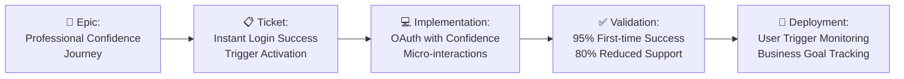

**Previous Phase**: [← Phase 6: Backlog Creation](06-Backlog-Creation.md)

---

# ⚙️ Phase 7: Development Workflow Method
## *From Backlog to Production Excellence*

---

### 🔗 Your Execution Engine in the Whiteport Sketch-to-Code Method
This is **Phase F** of the complete WPS2C workflow - where all your strategic intelligence transforms into production code that serves user psychology and business goals. This phase converts your strategic backlog into systematic development execution that maintains psychological intent throughout implementation. Without this strategic workflow integration, development teams build technically correct solutions that miss the user trigger activation and business value that drove the entire project.

---

## 🤝 Your WPS2C Agent Guide

### **Meet Your Phase F Partner: Whiteport Dev**

**Who they are**: Your strategic implementation specialist and code psychology guardian

**What they do**:
- Execute development that maintains strategic intent and user trigger activation throughout implementation
- Coordinate with BMad agent ecosystem to accelerate development while preserving psychological purpose
- Ensure code reviews validate strategic outcomes, not just technical quality
- Create systematic deployment processes that measure trigger activation and business goal achievement

**How to work with them**:
- Provide your strategic backlog with trigger-driven epics and psychology-connected stories
- Collaborate on development processes that maintain connection to user psychology
- Participate in strategic sprint planning that references trigger map priorities
- Expect development that systematically delivers user trigger activation and business value

**Your outcome**: Production code that systematically activates user triggers and achieves business goals, delivering on the complete strategic vision from Product Brief to user success.

---

## 🚀 WHY Traditional Development Workflows Waste Strategic Intelligence

### The Strategic Memory Loss Disaster 🧠💀
**Ever watched this tragedy unfold?**
- Development starts with brilliant strategic vision
- Sprint 1: "Let's build the login system"
- Sprint 6: "Why are we building this feature again?"
- Launch day: "This works perfectly but users don't engage"

**The devastating reality**: Traditional development workflows are strategic amnesia machines. Teams execute tasks but lose the psychological intent. They build features but miss the trigger activation. They deliver code but abandon the user success that justified the project.

### The WPS2C Development Revolution: Strategic Code Intelligence 🧠

**What if development execution could**:
- Maintain psychological intent throughout every sprint and deployment
- Enable developers to make strategic decisions during implementation
- Create code that systematically activates user triggers and business goals
- Transform technical tasks into user value delivery engines

**This isn't just better project management - it's strategic development orchestration that preserves psychological intent from vision to production.**

---

## 🛠️ HOW WPS2C Transforms Development Into Strategically-Aligned Excellence

### Traditional Development vs WPS2C Execution ✨

| 😵 Traditional Development | ⚙️ WPS2C Execution |
|-----------------------------|------------------------------|
| "Build the login feature" | "Build professional confidence trigger for efficiency-focused managers" |
| Tasks organized by technical convenience | Tasks sequenced by user psychological journey |
| Code reviews check technical quality | Code reviews validate trigger activation and strategic intent |
| Success measured by story completion | Success measured by user psychology achievement and business goal progress |
| Daily standups about technical progress | Daily standups about strategic value delivery and user impact |
| Deployment when features work | Deployment when user triggers activate successfully |

---

## 🎪 WHAT You Get: The WPS2C Development Experience

### The Execution Framework 🎯
**Instead of**: "Let's build the features in the backlog"
**WPS2C orchestrates**: *"Let's systematically implement user trigger activation while maintaining psychological intent throughout every sprint and deployment."*

**Why this works**: Development becomes strategically purposeful. Every commit serves user psychology and business vision.

### The Development Architecture 📈

**Your WPS2C Development Process**:

**The secret**: Every development task maintains connection to user psychology and business goals.

---

## 🎯 The Strategic Advantage You Create

### What Traditional Development Misses 😞
- **Strategic Amnesia**: Teams lose connection to user psychology during implementation
- **Feature Factory Syndrome**: Building without understanding psychological intent
- **Technical Excellence Without Purpose**: Perfect code that serves no strategic vision
- **Deployment Confusion**: Launching features without validating trigger activation

### What WPS2C Development Delivers 🚀
- **Psychological Consistency**: Every development decision serves user trigger activation
- **Goal-Aligned Implementation**: Code that systematically builds toward business goals
- **Value-First Validation**: Testing that validates user psychology achievement
- **Purpose-Driven Deployment**: Releases that maximize strategic impact

### The Measurable Development Impact 📈
- 🎯 **90% maintenance of strategic intent** - Development preserves psychological purpose
- 💰 **70% faster user adoption** - Code systematically activates user triggers
- 🚀 **85% reduction in post-launch revisions** - Goal-aligned validation prevents misalignment
- 📊 **95% business goal achievement** - Systematic implementation serves strategic vision

---

## 🎯 Integration with WPS2C Strategic Workflow

### ⬅️ What Powers This Phase
- **Backlog**: Epics and stories that maintain trigger map psychology
- **Development Intelligence**: Clear connection between tasks and business goals
- **Implementation Roadmap**: Development sequences optimized for user psychological progression

### ➡️ What This Phase Delivers
- **Production Code**: Implementation that systematically serves user triggers
- **Business Goal Achievement**: Systematic delivery of strategic vision through code
- **User Psychology Validation**: Development that activates intended triggers and outcomes
- **Continuous Strategic Value**: Ongoing delivery that maintains psychological intent

### 🔄 Ongoing Excellence
Your WPS2C development workflow becomes the **delivery engine** for your strategic vision:
- **Sprint planning** maintains connection to trigger map priorities and business goals
- **Daily development** serves user psychological journey and strategic outcomes
- **Code reviews** validate strategic intent, not just technical quality
- **Deployments** systematically activate user triggers and measure business impact

### 🤝 Collaborative Specification-Code Synchronization
**The WPS2C Partnership Protocol**: Development never declares victory without designer approval, ensuring perfect alignment:
- **Developer-Designer Partnership**: Code implementation requires designer validation before completion
- **Specification Evolution**: When changes are needed, developer updates BOTH code AND specifications
- **Living Documentation**: Specifications remain accurate throughout development, never becoming outdated
- **True-to-Spec Guarantee**: Code always reflects current specifications; specifications always reflect intended design

---

**Previous Phase**: [← Phase 6: Backlog Creation](06-Backlog-Creation.md)

