# EchoVoice - National Hyperlocal News Platform

> **AI-powered hyperlocal news platform delivering geographically relevant content to users based on proximity and relevance**

## Introduction

EchoVoice is a national hyperlocal news platform that addresses the critical gap left by declining local journalism. Using AI agents to monitor local sources and generate community-focused content, EchoVoice delivers "People, Places and Faces" stories that connect neighbors and build stronger communities.

**Vision**: Disrupt legacy media by proving geo-tagged hyperlocal content delivers superior local relevance while revolutionizing how local businesses leverage their proximity advantage.

**Target**: Launch in all 290 Swedish municipalities by end of 2025, with international expansion planned for 2026-2028.

**Technology**: Built on WordPress with the Whiteport Social Stream Plugin, enabling scalable AI-powered content generation with geographic precision.

## Strategic Value Model & Target Groups

```mermaid
flowchart LR
    %% Business Goals on LEFT
    BG1["🎯 Disrupt Legacy Media<br/>3x engagement vs traditional"]
    BG2["🌍 Fill Hyperlocal Gap<br/>All 290 municipalities"]
    BG3["💼 Revolutionize Local Business<br/>Proximity-based advertising"]
    
    %% Central EchoVoice Node
    EV["🌐 EchoVoice<br/>Hyperlocal News Platform"]
    
    %% Target Groups with descriptions
    TG1A["👥 Sture Social<br/><b>Reader - Active Community Connector</b><br/>55, single, highly social<br/>Member of multiple NGOs & clubs"]
    TG1B["👨‍👩‍👧‍👦 Clara Curlingmum<br/><b>Reader - Time-Pressed Parent</b><br/>Stressed parent, partner travels<br/>Needs activities for active children"]
    TG2["🏪 Ellen Entrepreneur<br/><b>Advertiser - Local Business Owner</b><br/>Café owner competing with chains<br/>Wants geographic marketing advantage"]
    TG3["🏛️ Patricia Partner<br/><b>Partner - Municipal Coordinator</b><br/>Communications coordinator<br/>Distributes official information"]
    TG4["👔 Peter Public-servant<br/><b>Public Servant - Council Member</b><br/>Municipal council member<br/>Maintains constituent connections"]
    
    %% Combined Driving Forces
    DF1A["<b>Sture's Driving Forces</b><br/>✅ Discover social events<br/>✅ Stay informed as community hub<br/>✅ Find local discounts<br/>❌ Miss social opportunities<br/>❌ Feel uninformed<br/>❌ Experience loneliness"]
    DF1B["<b>Clara's Driving Forces</b><br/>✅ Find family activities efficiently<br/>✅ Feel connected to community<br/>✅ Access practical resources<br/>❌ Waste time researching<br/>❌ Feel disconnected<br/>❌ Disappoint children"]
    DF2["<b>Ellen's Driving Forces</b><br/>✅ Promote business to locals<br/>✅ Compete with chains<br/>✅ Build community relationships<br/>❌ Lose to chain competitors<br/>❌ Miss local customers<br/>❌ Struggle with marketing"]
    DF3["<b>Patricia's Driving Forces</b><br/>✅ Distribute municipal info<br/>✅ Ensure timely updates<br/>✅ Improve citizen engagement<br/>❌ Citizens miss updates<br/>❌ Poor information reach<br/>❌ Low civic engagement"]
    DF4["<b>Peter's Driving Forces</b><br/>✅ Maintain constituent connections<br/>✅ Share policy updates<br/>✅ Build transparency<br/>❌ Lose constituent trust<br/>❌ Poor communication<br/>❌ Reduced transparency"]
    
    %% Flow: Goals → EchoVoice → Target Groups → Driving Forces
    BG1 --> EV
    BG2 --> EV
    BG3 --> EV
    
    EV --> TG1A
    EV --> TG1B
    EV --> TG2
    EV --> TG3
    EV --> TG4
    
    TG1A --> DF1A
    TG1B --> DF1B
    TG2 --> DF2
    TG3 --> DF3
    TG4 --> DF4
    
    %% Styling - Light Gray Palette
    classDef businessGoal fill:#f3f4f6,color:#000000,stroke:#d1d5db,stroke-width:3px
    classDef echovoice fill:#e5e7eb,color:#000000,stroke:#d1d5db,stroke-width:4px
    classDef targetGroup fill:#f9fafb,color:#000000,stroke:#d1d5db,stroke-width:2px
    classDef drivingForces fill:#f3f4f6,color:#000000,stroke:#d1d5db,stroke-width:2px
    
    class BG1,BG2,BG3 businessGoal
    class EV echovoice
    class TG1A,TG1B,TG2,TG3,TG4 targetGroup
    class DF1A,DF1B,DF2,DF3,DF4 drivingForces
```

### Key Strategic Insights from User Research

**Primary Revenue Driver**: Reader engagement from Sture Social and Clara Curlingmum creates the audience that makes EchoVoice valuable to advertisers, partners, and public servants. Their success is fundamental to platform viability.

**Network Effect**: Each user type strengthens the others - more readers attract advertisers, municipal partners provide credible content that attracts readers, and public servants add civic value that increases overall community engagement.

**Geographic Differentiation**: All content features geo-tagging as a primary organizing principle, creating competitive advantage over national media and social platforms that treat location as secondary.

## Market Opportunity & Business Case

Our research reveals a significant market gap where traditional local journalism decline meets growing community need for hyperlocal information. The platform addresses this through three key strategic advantages:

**Cost Structure Innovation**: AI automation eliminates the cost barriers that killed local journalism while maintaining quality through human oversight.

**Geographic Precision**: Geo-tagging as primary content filter creates competitive moat against both national media and social platforms that treat location secondarily.

**Revenue Model Resilience**: Multiple user types create network effects - reader engagement attracts advertisers, while municipal partnerships and civic content add credibility that further attracts readers.

## Detailed Research & Documentation

**Strategic Foundation**: [Product Brief](docs/A.%20Product%20Brief/brief.md) - Market analysis, technical architecture, and development roadmap

**User Research**: [Trigger Map](docs/B.%20Trigger%20Map/00-trigger-map.md) | [Visual Overview](docs/B.%20Trigger%20Map/00-trigger-map-poster.md) - Business goal alignment with user needs

**Target Group Profiles**: [Sture Social](docs/B.%20Trigger%20Map/01-sture-social.md) | [Clara Curlingmum](docs/B.%20Trigger%20Map/01b-clara-curlingmum.md) | [Ellen Entrepreneur](docs/B.%20Trigger%20Map/02-ellen-entrepreneur.md) | [Patricia Partner](docs/B.%20Trigger%20Map/03-patricia-partner.md) | [Peter Public-servant](docs/B.%20Trigger%20Map/04-peter-public-servant.md)

## Strategic Insights

### Network Effect Model
The platform creates value through interconnected user types:
- **Readers** provide the audience that makes the platform valuable to other groups
- **Advertisers** provide primary revenue through local business promotion  
- **Partners** provide official content that enhances credibility and completeness
- **Public Servants** add civic value that increases overall community engagement

### Geographic Differentiation
All content features geo-tagging that complements topic-based tags, making geographic proximity a primary organizing principle rather than secondary consideration. This creates the platform's core competitive advantage over both national media and social media platforms.

### AI-First Approach
Automated monitoring and content generation reduces the cost barriers that killed traditional local journalism while maintaining editorial quality through human oversight processes.

## Development Priorities

### Phase 1: Reader Experience Foundation
Success depends on creating exceptional value for Readers (Sture Social & Clara Curlingmum), whose engagement creates the audience that attracts Advertisers, Partners, and Public Servants.

**Critical Success Factors:**
- AI-generated content quality and local relevance
- Geographic precision in content matching and delivery
- Update frequency competitive with social media
- User experience superior to current fragmented information gathering

### Phase 2: Revenue Model Validation
Balanced value creation across all user types with primary revenue from local business advertising, supported by partnership content and civic engagement features.

## Technical Foundation

- **Publishing Platform**: WordPress for proven scalability and developer ecosystem
- **Core Plugin**: Whiteport Social Stream Plugin optimized for geo-tagged article publication
- **AI Architecture**: Specialized monitoring, assessment, and content generation agents
- **Geographic Engine**: Location-based content matching and delivery system
- **Quality Assurance**: Human editorial oversight for content approval before publication

## Market Context

**Problem**: Decline of local journalism creates information gaps while national news dominates and social media fails to surface geographically relevant content about nearby people and events.

**Opportunity**: AI technology advancement makes automated journalism viable while community need for local information grows stronger.

**Timing**: First-mover advantage in hyperlocal AI news before competition validates the market concept.

---

**Project Status**: Product Brief and Trigger Map completed. Ready for detailed persona development and technical requirements specification.

**Founded by**: Anna Bansell  
**Main Investor**: Karl-Mikael Cakste  
**Development Partner**: Whiteport AB
